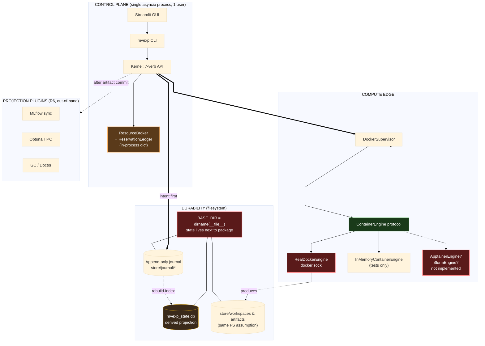

# `multiverse` / `mvexp` — Architectural Review

**Reviewer role:** Staff MLOps Architect (external)
**Review date:** 2026-05-28
**Branch reviewed:** `multiverse` @ HEAD `8ebe5ca`
**Confirmed product boundary:** single-user *now*, multi-user *possibly later*,
**HPC execution in scope now**.

---

## 0. Calibration

The boundary above changes the review materially. In particular:

- **"HPC in scope now"** elevates two issues that would otherwise be roadmap items:
  Docker as the only `ContainerEngine` implementation (HPC clusters do not let you
  run Docker), and the state-directory location (the current code writes the SQLite
  DB and the artifact store into the *installed Python package directory*, which is
  read-only on a shared cluster install).
- **"Multi-user later"** is not a feature; it is a *design constraint* — "don't burn
  bridges." Concretely: every place that today encodes "the user" implicitly (paths,
  ledger keys, journal namespaces) should accept a `user_id` *now*, even if it is
  always `"local"`. Retrofitting tenancy after the fact is an order of magnitude
  more painful than threading an unused identifier through today.
- **"Single-user now"** still means a second concurrent kernel is not a goal. The
  in-memory `ReservationLedger` is fine for what it does — but its role changes
  under Slurm (see §2.3).

Two prompt framings I'm correcting up front, same as the prior draft:

1. **Docker is not hardcoded.** The kernel talks to a `ContainerEngine` protocol
   ([docker_supervisor/client.py](multiverse/docker_supervisor/client.py)). The
   problem is not coupling — it is that the protocol has exactly one real
   implementation. Pluggable in theory; un-tested in practice.
2. **SQLite is not "the registry."** It is a derived projection over the journal,
   and STRATEGY.md's own exit criterion is "delete `mvexp_state.db`, run
   `rebuild-index`, get the same answers back." Treat it as a cache for the rest
   of this document.

---

## 1. Architecture diagram (current state, HPC danger zones)



**Red = blocks HPC today. Amber = fine single-user, wrong shape under a batch scheduler.
Yellow = derived-and-rebuildable. Green = healthy abstraction.**

---

## 2. The three real risks (given HPC-in-scope)

I'm ranking by *how soon they bite a real HPC user*. Single-user-only is not a
mitigation here — every one of these fires on day one of running on a Slurm cluster.

### 2.1 State directory is hardcoded next to the installed package

[registry_db.py:7–10](multiverse/registry_db.py#L7-L10):

```python
BASE_DIR = os.path.dirname(os.path.dirname(os.path.abspath(__file__)))
DB_NAME  = os.path.join(BASE_DIR, "mvexp_state.db")
STORE_DIR = os.path.join(BASE_DIR, "store")
```

This works only when the user runs from a writable checkout. On HPC:

- The package will typically be installed into a shared environment / module / conda
  prefix that the *user* cannot write to.
- Even when it *is* writable, every co-tenant of that install collides on the same DB
  and store.
- It also means there is no per-user namespacing today — which is the multi-user-future
  bridge being burned right now.

**Fix shape (one PR, days of work, blocks several other items):**

- Resolve paths from config + env, in this priority: `$MVEXP_STATE_DIR` → config file
  → `$XDG_STATE_HOME/mvexp` → `$HOME/.mvexp`.
- Make `(state_root, user_id)` a single struct threaded through `KernelConfig`. `user_id`
  defaults to `getpass.getuser()` today; the multi-user-future just lifts where the
  identifier comes from.
- Add a `mvexp doctor` check that refuses to start if `state_root` is inside the
  package install path.

**Why I'm calling this risk #1:** it's the cheapest fix, it's a hard blocker for HPC,
and it is the *only* change in this review that affects multi-user-future. Doing it
later is doable but irritating; doing it now is free.

### 2.2 The only `ContainerEngine` implementation is Docker — HPC does not run Docker

Most HPC sites disallow the Docker daemon (root daemon, network namespaces, image
cache outside the user's quota). Apptainer / Singularity is the standard. The
abstraction to support a second engine is already in place
([docker_supervisor/client.py](multiverse/docker_supervisor/client.py)) — what's
missing is a second implementation that proves the protocol covers the HPC shape.

**Subtleties the abstraction probably does *not* yet capture (audit before
implementing):**

- **No long-running container.** Apptainer typically runs a foreground process and
  exits. The "exec into a running container" pattern, if used anywhere, won't carry
  over. Confirm the supervisor only relies on "start → wait → exit-code → logs."
- **No daemon, no labels.** Crash reconciliation today queries Docker by label
  `multiverse.run_id`. Apptainer has no equivalent; reconciliation must come from
  the journal + process state (PID file + `/proc` check, or — better — from Slurm
  itself when running under a job scheduler).
- **Image format.** SIF, not OCI layers. Image digest capture in the manifest must
  cover SIF hashes too; otherwise the provenance story degrades under Apptainer
  (see §3 leak #1).
- **Resource limits.** Docker passes `--memory`, `--cpus`, `--gpus`; Apptainer relies
  on cgroups inherited from the calling shell or from Slurm. The broker's
  bin-packing assumption gets weaker (see §2.3).

**Fix shape:** ship `ApptainerEngine` as the second `ContainerEngine`. This is the
single most leveraged piece of work on the roadmap. The image-format question
("two recipes or one?") is addressed in **Addendum B**.

### 2.3 The `ResourceBroker` does work that Slurm wants to do

The broker's job is RAM bin-packing across concurrent runs on one node
([broker/broker.py:78–108](multiverse/broker/broker.py#L78-L108)). Under Slurm, this
is *not your job*: the cluster scheduler does it, and doing it again inside the
allocation just makes the allocation less efficient. Two distinct deployment modes
emerge, and the kernel today only supports one:

- **Mode A: kernel runs on a login/dev node, dispatches jobs via `sbatch`.** The
  broker is bypassed — each `submit_run` becomes an `sbatch` with its own
  `--mem` / `--cpus-per-task` / `--gres=gpu:...`. The kernel must not block
  waiting for a Slurm job; it journals the `sbatch` ID and polls (or subscribes
  via `sacct`).
- **Mode B: the entire kernel runs inside one allocation.** Now the broker *is* the
  right tool — it's bin-packing inside the slice Slurm gave you.

The current architecture implicitly assumes Mode B without naming it. A Slurm
adapter that doesn't make this distinction will mis-account resources in Mode A
because the in-memory ledger will think it has the whole login node.

**Fix shape:** a `SlurmRunExecutor` (sibling to the current `RunExecutor`) that
replaces "start container → wait" with "sbatch → poll". The broker stays for Mode
B; in Mode A its *role shifts* (RAM bin-packing → dispatch rate-limiting) rather
than going away. **Addendum A** lays out the full executor matrix and the
capability-detection at setup time.

### Risks the prompt asked about that I'm *not* counting here

- **SQLite WAL "ceiling."** Not a risk under your boundary. SQLite is a projection;
  it isn't on any hot path that matters. Documented exit criterion is "delete and
  rebuild." Don't fix what isn't broken.
- **Atomic promotion across filesystems.** Real concern on HPC (workspace on
  `/scratch`, artifacts on `/projects`), but the existing same-FS check + copy
  fallback ([promotion/saga.py](multiverse/promotion/saga.py)) is the correct
  shape; the leak is that the fallback doesn't preserve atomicity. Worth
  addressing eventually (CAS — see roadmap), but it is *not* the highest-leverage
  item the way it would be in a hosted/distributed product.

---

## 3. Provenance & immutability audit

Provenance capture is the strongest part of this system. From
[mvd/docker_executor.py:326–423](multiverse/mvd/docker_executor.py#L326-L423):
`image_digest`, `dataset_fingerprint`, `params_hash`, `manifest_hash`,
`mv_contract_version`, `mvd_version`, `git_commit`, `seed`, per-file `.sha256`
sidecars. Above the bar for academic benchmarking. The leaks are real but local.

**Leak 1 — `ImageIdentity.unverified_local()` is a back door.** If the image was
built locally and never digest-pinned, the manifest records a name, not a hash.
"myimage:latest" two years from now is a different image. *Fix:* fail-closed
unless `accept_degraded`. **This leak gets worse under Apptainer** because the
SIF digest path is new code; spec it before shipping `ApptainerEngine`.

**Leak 2 — Dataset fingerprint is structural, not content.** `(name, n_obs,
n_vars)` collides for two AnnData objects with the same shape and different
values. *Fix:* hash the registered dataset bytes once at registration time and
record both fingerprints in the manifest.

**Leak 3 — `git_commit` ignores working-tree dirtiness.** A run from a dirty
tree quietly records the parent commit. *Fix:* record `is_dirty` and (ideally)
a patch hash; refuse promotion from dirty trees unless `accept_degraded`.

**Reproducibility question, answered directly:** can a researcher reproduce a
2-year-old run from `store/artifacts/` alone? **No** — they also need the
journal, the registered dataset bytes, and a registry of image digests resolvable
to actual layers (your local image cache or a registry mirror). The first two are
inside `store/`; the third is *external*. Pin image digests (close leak 1) and
mirror datasets (close leak 2) and the answer becomes yes.

---

## 4. Roadmap — six months, HPC-shaped

Reordered for the new boundary. Effort estimates assume one engineer.

### F1. Configurable state directory + multi-user-ready paths *(days)*

Fix §2.1. Threads `user_id` through `KernelConfig` (defaults to `getpass.getuser()`).
Adds a doctor check. This is the bridge to multi-user-future and the
prerequisite for any HPC deployment that isn't a writable checkout.

### F2. `ApptainerEngine` *(2–3 weeks)*

Second real `ContainerEngine`. The single largest leverage win. Forces the
abstraction to be honest, removes the Docker requirement on clusters, and
becomes the template for §F4. Audit the four subtleties listed in §2.2 *before*
the implementation, not after.

### F3. Journaled admission ledger *(1 week)*

The `ReservationLedger` becomes a journal record written *before* container
start, released on terminal transition. This is small-surface but high-impact:

- Crash recovery stops depending on Docker-label scraping (which Apptainer
  doesn't provide).
- Doctor and GC can reason about live reservations without a live kernel.
- Multi-user-future gets per-user ledger views for free.

Do this *between* F2 and F4 because the Apptainer crash-recovery path needs
it (no labels to fall back on).

### F4. `SlurmRunExecutor` *(3–4 weeks)*

The actual HPC feature. `sbatch` dispatch, `sacct` polling, structured failure
classification (`OOM`, `TIMEOUT`, `CANCELLED`, `NODE_FAIL`). Decision needed
early: support Mode A (login-node dispatch) only, or both modes (§2.3). I'd
ship Mode A first — it is the more common ask, the more independent of
allocation-policy quirks, and the better fit for HPO sweeps.

### Stretch / explicitly deferred

- **Content-addressed artifact store.** Would close the cross-FS atomicity
  weakness and deduplicate datasets across runs. Worth doing, not urgent given
  the boundary. ~6 weeks; defer to Q+1.
- **Remote manifest sync.** Out of scope under the current boundary.
- **Ray.** Solves a problem you don't have. Don't.

---

## 5. The kill list — exactly one

**Delete: `multiverse/registry_db.py`'s role as a "registry."**

Same answer as the prior draft, and HPC-in-scope makes it sharper, not weaker. To
be precise: I'm not asking to delete the SQLite file. I'm asking to stop calling
it a registry and stop letting it accumulate write paths. The 538 lines of
[registry_db.py](multiverse/registry_db.py) should become ~150 lines of
`index_projection.py` — a read-mostly projection rebuilt from journal +
manifests on demand (DuckDB-over-Parquet or a plain in-memory scan, either is
fine). The justification is unchanged:

- **Your own docs already say it's expendable** ("delete and rebuild" is the
  exit criterion). A component your team has formally documented as
  reconstructible should not be a 538-line write-path at the center of the
  control plane.
- **It is the source of the multi-writer anxiety** that ate half of the prompt.
  Demote it and "the SQLite ceiling" stops being a question.
- **It is the file most likely to acquire HPC-incompatible assumptions** (file
  locks on NFS, mmap'd pages, journal modes that misbehave on Lustre). The less
  of it there is, the less you have to audit for shared-filesystem semantics
  when F4 lands.
- **Replacement is small and well-trodden.**

Things I considered killing and rejected:

- *Streamlit GUI as control plane* — already drives via the manifest contract;
  the coupling is thin. Under HPC, the GUI shifts to "login-node tool that
  drafts a manifest and submits via the CLI." That's fine; no kill warranted.
- *The `simple/` runner* — looks like a deliberate Docker-free escape hatch.
  Don't delete; *unify* it with F2 once `ApptainerEngine` exists, because
  `simple/` is conceptually the same shape as a plain-subprocess engine.
- *MLflow* — R6 already keeps it off the hot path. It earns its keep.

---

## Closing

The system has unusually good provenance bones and an already-abstracted
compute boundary. With HPC in scope and multi-user as a soft future, the work
that pays back the most is **the order above**, in that order: configurable
state paths (so anyone can actually install this on a cluster), a real second
`ContainerEngine` (so Apptainer works), a journaled admission ledger (so crash
recovery survives the loss of Docker labels), and finally a Slurm executor
(the actual HPC feature). The single piece of incidental complexity worth
deleting in the same window is the "registry" framing of `registry_db.py`.

What I would not do is chase distributed-system features that the boundary
doesn't ask for. The strongest version of this product is *the local
benchmarking platform that also runs on the cluster you already have*, not a
shrunken hyperscale system.

---

## Addendum A — Executor matrix and capability detection

**Question this addresses:** is "local vs HPC" a one-time setup choice, or
per-run?

**Answer:** per-run (or per-profile), not setup-time. A login-node user
routinely wants both — dispatch the expensive training to Slurm, but run a
30-second validation container locally without the scheduler overhead. Setup
detects capabilities and picks a *default*; the manifest may override.

### Executors (three, not two)

| Executor | Image format | Broker's gate criterion | Typical deployment |
|---|---|---|---|
| `LocalDockerExecutor` | OCI (Docker) | RAM bin-packing | Laptop / workstation with Docker daemon |
| `LocalApptainerExecutor` | SIF (or OCI pulled on-the-fly) | RAM bin-packing | Workstation without Docker; HPC compute node inside one allocation (Slurm "Mode B") |
| `SlurmRunExecutor` | SIF (preferred) or OCI via `apptainer pull` | **Dispatch rate-limiting** (≤N in-flight `sbatch`) | Login node dispatching to the cluster ("Mode A") |

All three share the journal contract, the state machine, the promotion saga,
and the manifest schema. They differ only in (a) which `ContainerEngine` they
hand off to, and (b) what the broker *gates*.

### The broker's role under each executor

This is the part that's easy to get wrong:

- Under `LocalDockerExecutor` / `LocalApptainerExecutor`: broker gates on
  **RAM and GPU VRAM** (current behavior). It is bin-packing one machine.
- Under `SlurmRunExecutor`: broker gates on **outstanding `sbatch` job count**
  (and optionally per-user queue pressure from `squeue`). It is not packing
  resources — Slurm does that — it is preventing the kernel from being a rude
  cluster citizen during HPO sweeps.

In code terms: the `ReservationLedger`'s `total_ram()` and
`gpu_indices_in_use()` are *Mode B questions*. Mode A needs different
predicates (`pending_dispatches()`, `running_dispatches()`). Same ledger
shape, different gates.

### Setup-time capability detection

`mvexp doctor` (or first-run setup) probes:

1. `docker info` succeeds → `LocalDockerExecutor` available.
2. `which apptainer` → `LocalApptainerExecutor` available.
3. `which sbatch` → `SlurmRunExecutor` available; also probe `sacct` and the
   partition list.

The detected set goes into the config as `available_executors`. The user
picks a `default_executor`; the manifest may name any executor from
`available_executors`. Doctor refuses to mark an executor "available"
without a successful end-to-end smoke job — capability detection that
trusts `which` alone is how silent regressions ship.

### Implication for F2/F3/F4 sequencing

The roadmap order in §4 is unchanged, but the *shape* of F4 is now:
"`SlurmRunExecutor` with dispatch-rate-limiting broker." Without that
caveat, a naive Slurm executor will either over-dispatch (broker bypassed
entirely) or under-utilize (broker still applying RAM math to a cluster
it can't see).

---

## Addendum B — Image format strategy (one recipe, two consumption paths)

**Question this addresses:** does local-Docker / HPC-Apptainer mean model
authors maintain two image recipes?

**Answer:** no. One OCI recipe is the source of truth; SIF is a *derived
artifact*. Asking authors for two recipes is how a benchmarking platform
silently produces non-comparable results across backends — the exact failure
mode a benchmarking platform exists to prevent.

### The recipe contract

Model authors submit exactly one of:

1. A `Dockerfile` (multiverse builds the OCI image at registration time).
2. A pinned OCI reference (`registry/name@sha256:…`).

That's it. Authors never write a `.def` file, never run `apptainer build` by
hand, and never have to know which executor will consume their model.

### How each executor consumes that one recipe

- `LocalDockerExecutor`: runs the OCI image directly. Records OCI digest in
  the manifest (existing behavior).
- `LocalApptainerExecutor`: either `apptainer pull docker://…` at run time,
  or consumes a pre-built SIF whose provenance points back to the OCI digest.
- `SlurmRunExecutor`: same as `LocalApptainerExecutor`, but the SIF should be
  *pre-built in CI* from the OCI image, then pushed to a cluster-readable
  location. Pulling OCI on the login node at submit time works but is rude
  to bandwidth and slow for HPO sweeps.

### Manifest changes (closes provenance leak #1 cleanly)

The current `image_digest` field is single-valued. Under multi-backend execution
it must become a small structure:

```yaml
image:
  oci_digest:  sha256:abc…   # always present; source of truth
  sif_digest:  sha256:def…   # present iff executed via Apptainer
  sif_built_from: sha256:abc…   # back-pointer; MUST equal oci_digest
  built_by:    "ci"|"apptainer-pull-runtime"|"author-supplied"
  unverified:  false          # only true under accept_degraded
```

The `sif_built_from == oci_digest` invariant is the thing that makes runs
comparable across backends. Verify it at promotion time, not at submission;
fail the run (not just warn) if the invariant breaks.

### Why this matters beyond aesthetics

If a model's local-Docker run on a laptop scores 0.91 and its HPC-Apptainer
run scores 0.89, you need to be able to *prove* the images were identical
before blaming anything else (data layout, hardware, library nondeterminism).
The dual-digest manifest is what makes that proof possible. Without it,
"reproducibility across backends" reduces to trust.

### What this does *not* require

- No image registry of your own. Authors can keep using Docker Hub / GHCR /
  any OCI registry.
- No CI infrastructure on the user's part for the local case. CI-built SIFs
  are only needed for production HPC dispatch (F4), and even there
  `apptainer pull` is a valid fallback.
- No change to the `ContainerEngine` protocol — the digest structure is
  reported through the existing manifest path, not the engine API.

