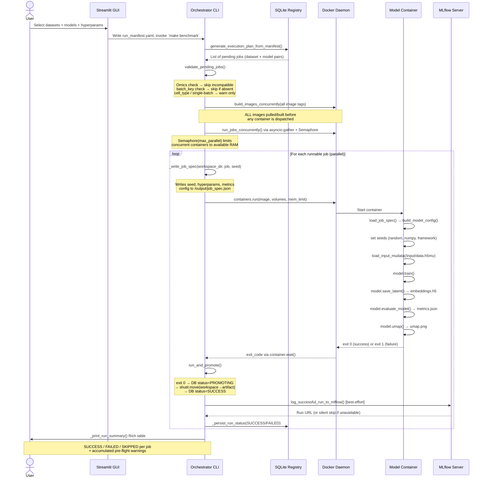

# Architecture Reference

Multi-verse is a **Registry-and-Store** MLOps platform. The orchestrator plans, validates,
and dispatches work; model containers are pure black boxes that read data and write results
through fixed mount paths. No orchestrator code runs inside a container.

---

## Core Concepts

| Concept | What it means |
|---|---|
| **Registry** | SQLite database (`mvexp_state.db`) tracking datasets, models, and runs |
| **Store** | Filesystem hierarchy under `store/` for raw data, workspaces, artifacts, and service DBs |
| **Zero-Path Contract** | Containers read from `/input/data.h5mu`, write to `/output/`. No hardcoded paths anywhere else |
| **Workspace** | Ephemeral staging dir `store/workspaces/run_<id>/` used during execution |
| **Artifact** | Immutable promoted dir `store/artifacts/<experiment>/<dataset>/<model>/<run_id>/` |
| **Promotion** | `shutil.move(workspace → artifact)` — only happens on container exit 0 |
| **Observability services** | MLflow server and Optuna Dashboard running as Docker Compose services, sharing `./store` |
| **WAL mode** | All SQLite DBs use `PRAGMA journal_mode=WAL` for safe concurrent reads alongside writes |

---

## Filesystem Hierarchy

```
mvexp_state.db                      ← SQLite registry (single file, WAL mode)
store/                              ← shared volume root (host ↔ Docker services)
  mlflow.db                         ← MLflow backend store (WAL mode; created by MLflow service)
  optuna.db                         ← Optuna study storage (WAL mode; created by Optuna service)
  datasets/
    <slug>/
      dataset.yaml                  ← dataset manifest
      data/
        raw_rna.h5ad
        raw_atac.h5ad
        processed.h5mu              ← fused MuData written by preprocess-dataset
  models/
    pca/
      model.yaml                    ← model manifest (slug, version, image, omics)
      container/
        Dockerfile
        environment.yml
    multivi/  mofa/  mowgli/  cobolt/  totalvi/
  workspaces/
    run_abc123def456/               ← live staging dir (deleted or promoted on exit)
      job_spec.json                 ← written by orchestrator before container start
      container.log
      embeddings.h5
      metrics.json
      umap.png
  artifacts/
    benchmark_run/                  ← experiment name (from manifest globals)
      pbmc10k/                      ← dataset slug
        pca/                        ← model slug
          run_abc123def456/         ← promoted workspace (immutable after promotion)
            run_manifest.yaml       ← copy of the manifest that produced this run
            job_spec.json
            embeddings.h5
            metrics.json
            umap.png
            container.log
```

---

## Job Lifecycle: Sequence Diagram



---

## Database Schema

```sql
-- Registered datasets
CREATE TABLE datasets (
    id             INTEGER PRIMARY KEY AUTOINCREMENT,
    slug           TEXT UNIQUE NOT NULL,     -- e.g. "pbmc10k"
    name           TEXT NOT NULL,
    path           TEXT NOT NULL,            -- absolute path to .h5mu
    omics_available TEXT NOT NULL,           -- JSON array: ["rna","atac"]
    batch_key      TEXT,                     -- obs column name for batch
    cell_type_key  TEXT,                     -- obs column name for cell type
    manifest_path  TEXT,
    manifest_hash  TEXT,
    status         TEXT NOT NULL             -- READY | PENDING | ERROR
);

-- Registered model containers
CREATE TABLE models (
    slug                    TEXT NOT NULL,   -- e.g. "pca"
    version                 TEXT NOT NULL,   -- semver: "1.0.0"
    name                    TEXT,
    docker_image            TEXT NOT NULL,   -- "multiverse-pca:1.0.0"
    image_digest            TEXT,
    supported_omics         TEXT NOT NULL,   -- JSON array: ["rna"]
    manifest_path           TEXT NOT NULL,
    manifest_hash           TEXT NOT NULL,
    hyperparameters_schema  TEXT,            -- path to JSON Schema file
    status                  TEXT NOT NULL,   -- ACTIVE | DEPRECATED
    PRIMARY KEY (slug, version)
);

-- Execution history
CREATE TABLE runs (
    run_id        INTEGER PRIMARY KEY AUTOINCREMENT,
    dataset_id    INTEGER REFERENCES datasets(id),
    model_slug    TEXT,
    model_version TEXT,
    model_name    TEXT,
    status        TEXT NOT NULL,             -- SUCCESS | FAILED | PROMOTING
    output_path   TEXT,
    FOREIGN KEY (model_slug, model_version) REFERENCES models(slug, version)
);
```

---

## Container I/O Contract

Every model container, regardless of language or framework, must honour this contract:

| Direction | Path | Format | Written by |
|---|---|---|---|
| Input | `/input/data.h5mu` | MuData HDF5 (read-only) | Orchestrator (volume mount) |
| Config | `/output/job_spec.json` | JSON (see below) | Orchestrator before container start |
| Embeddings | `/output/embeddings.h5` | HDF5 dataset `latent` shape `(n_cells, n_dims)` | Container |
| Metrics | `/output/metrics.json` | JSON flat dict of scalar floats | Container |
| UMAP | `/output/umap.png` | PNG | Container (optional) |
| Logs | `stdout/stderr` | Plain text | Container (captured by Docker) |

**`job_spec.json` schema:**

```json
{
  "seed": 42,
  "dataset_name": "pbmc10k",
  "model_name": "pca",
  "hyperparameters": {
    "n_components": 50,
    "learning_rate": 0.001
  },
  "metrics": {
    "model_metrics": ["total_variance"],
    "bio_conservation": ["silhouette_label"],
    "batch_correction": ["graph_connectivity"]
  }
}
```

The container **must** exit 0 on success and non-zero on failure. Partial output files in the workspace are discarded — only promoted artifacts are retained.

---

## Concurrency Model

```
asyncio event loop (single thread)
│
├── run_in_executor(ThreadPool) ──► ensure_image_prepared(tag)   ┐ parallel
├── run_in_executor(ThreadPool) ──► ensure_image_prepared(tag)   ┘ image pulls
│
└── asyncio.Semaphore(max_parallel)
    ├── run_in_executor ──► run_and_promote(container_A)   ┐ bounded
    ├── run_in_executor ──► run_and_promote(container_B)   │ parallel
    └── (queued) ──────────────────────────────────────────┘ container runs
```

`max_parallel` defaults to `floor(available_host_RAM / mem_limit_per_job)` and can be overridden in `run_manifest.yaml` under `globals.max_parallel_jobs`.

---

## Observability Services

MLflow and the Optuna Dashboard run as Docker Compose services defined in `docker-compose.yml`.
They are **independent of the orchestrator** — benchmarks run whether or not the services are up.

```
docker-compose.yml
├── mlflow      (python:3.12-slim + mlflow, port 5000)
│     entrypoint: apply WAL mode to store/mlflow.db → mlflow server --backend-store-uri
├── optuna-ui   (python:3.12-slim + optuna-dashboard, port 8080)
│     entrypoint: apply WAL mode to store/optuna.db → optuna-dashboard
└── streamlit   (profile: gui — optional, not started by make services-up)
      mounts /var/run/docker.sock so the GUI can launch model containers
```

All three services mount `./store` as `/data` so they share the same SQLite databases and
artifact directories as the host orchestrator. WAL mode is applied by each entrypoint script
before the server starts; this is a persistent file property inherited by all subsequent
connections (including SQLAlchemy / mlflow-tracking on the host side).

```bash
make services-up    # starts mlflow + optuna-ui in the background
make services-down  # stops and removes containers
make status         # table: container name · health · port bindings
```

Port overrides via environment variables: `MLFLOW_PORT` (default 5000), `OPTUNA_PORT` (default 8080).

---

## Streamlit GUI Architecture

The GUI (`multiverse/gui.py`) is a 7-tab Streamlit application. It is a **thin client** —
it does not import `mlflow` tracking or any model framework; it communicates with external
services through HTTP (MLflow REST API, Optuna Dashboard HTTP).

```
gui.py
├── Sidebar
│     _render_observability_sidebar()  — urllib.request health-check every page load
│
├── Tab 1 — 📦 Registry         _render_registry_tab()
├── Tab 2 — 🧬 Job Builder      _render_job_builder_tab()
├── Tab 3 — ⚙️  Parameters      _render_parameters_tab()
├── Tab 4 — 🚀 Execute          _render_execute_tab()
│     ├── Resource Ledger        psutil RAM accounting + wave-admission simulation
│     ├── Launch & Monitor       subprocess.Popen + live log streaming
│     └── Live MLflow Metrics   _live_metrics_panel()  ← @st.fragment(run_every=5s)
│                                  └── gui_utils.fetch_live_metrics()
│                                        └── MlflowClient.search_runs() + get_metric_history()
│                                              @st.cache_data(ttl=5)  — max 1 API call / 5 s
│
├── Tab 5 — 📊 Results          _render_results_tab()
│     └── MLflow deep-link      _resolve_mlflow_experiment_id()  ← REST GET, no mlflow import
│                                  → st.session_state["active_experiment_id"]
│
├── Tab 6 — 🔬 Experiment Analysis   _render_mlflow_tab()
│     └── st.components.v1.iframe  src="{mlflow_base}/#/experiments/{id}"
│
└── Tab 7 — 📈 Sweep Tracker    _render_optuna_tab()
      └── st.components.v1.iframe  src="{optuna_base}"
```

**Service URL resolution**

| Env var | Default | Used for |
|---|---|---|
| `MLFLOW_UI_URL` | `http://localhost:5000` | GUI iframe + health check |
| `MLFLOW_TRACKING_URI` | (fallback for `MLFLOW_UI_URL`) | also consumed by host-side tracking |
| `OPTUNA_UI_URL` | `http://localhost:8080` | GUI iframe + health check |
| `OPTUNA_PORT` | `8080` | fallback port when `OPTUNA_UI_URL` is absent |

**Mixed-content note:** both iframes show a `st.caption` and a `st.link_button` fallback when
the browser blocks HTTP iframes inside an HTTPS page (e.g. remote deployment behind TLS).
In that case, front both services through the same TLS reverse proxy as Streamlit.

---

## Key Architectural Decisions

### Why SQLite and not PostgreSQL?

SQLite with WAL mode (`PRAGMA journal_mode=WAL`) supports concurrent readers and a single writer without blocking. For a single-machine benchmarking platform this is appropriate. If the platform scales to a distributed scheduler, the `registry_db.py` abstraction layer makes migration to PostgreSQL mechanical — only `get_db_connection()` changes.

### Why workspace-then-promote instead of writing directly to artifacts?

Guarantees that `store/artifacts/` contains only complete, successful runs. A failed or crashed container leaves a workspace dir (for debugging) but never corrupts the artifact store. The filesystem-level `os.rename` (same-filesystem) or `shutil.move` is the commit boundary.

### Why asyncio + ThreadPool instead of multiprocessing?

Model containers are independent OS processes managed by Docker. The orchestrator's async layer is purely I/O-bound — it submits `containers.run()`, then blocks on `container.wait()`. A ThreadPool inside `run_in_executor` handles the blocking Docker SDK calls without spawning additional Python processes.
