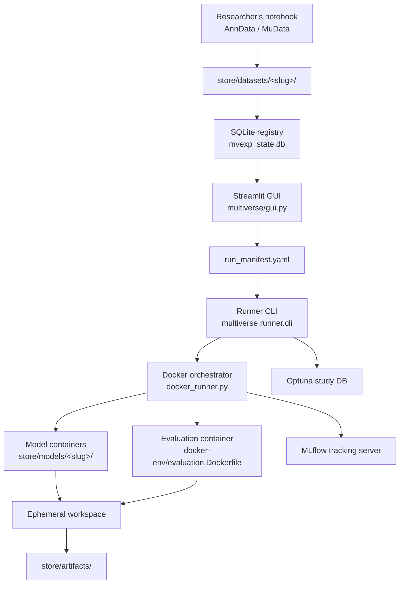

# Architecture

This page is the system map for mvexp. It is intended for platform engineers, MLOps practitioners, and contributors. The biology vocabulary is kept light here — when a domain term is unavoidable it is glossed inline. Researchers should start at [Getting Started](GETTING_STARTED.md) instead.

## What the System Is

mvexp is a Python 3.12 application built around four moving parts:

1. A **SQLite registry** (`mvexp_state.db`) that holds the canonical list of registered datasets, models, and runs.
2. A **Streamlit GUI** (`multiverse/gui.py`) that operates the registry, plans benchmarks, and supervises execution.
3. An **async orchestrator** (`multiverse/runner/`) that launches model containers in parallel against a manifest.
4. A pair of **observability services** (MLflow + Optuna Dashboard) shipped as Docker Compose containers in `docker-compose.yml`.

Models themselves run in per-method containers built from recipes under `store/models/<slug>/container/`. They depend only on a minimal SDK, `mvr-worker`, installed into each image at build time.

## System Diagram



## Repository Layout

```text
multiverse/                Python application package
  gui.py                   Streamlit entry point
  gui_navigation.py        Query-param routing across the 5 tabs
  gui_state.py             Session-state helpers
  gui_artifacts.py         Artifact tree browser
  gui_telemetry.py         Opt-in anonymous counters
  registry.py              Compatibility matrix logic
  registry_db.py           SQLite schema and connection (WAL mode)
  ingestion.py             Dataset manifest parsing and registration
  models_ingest.py         Model manifest parsing and registration
  multiverse_config.py     Top-level platform config
  config.py                Legacy config loader (pre-container era)
  dataloader.py            AnnData / MuData I/O with lazy ML imports
  data_utils.py            Concatenation, modality fusion, metadata gating
  evaluate.py              scib-metrics wrapper with metric gating
  tracking.py              MLflow integration
  builder.py               Local Docker image build helper
  migrate_data.py          Legacy-data migration utilities
  models/                  Model-class wrappers used by the local runner
  runner/
    cli.py                 init-db, register-*, run subcommands
    docker_runner.py       Async container supervision and promotion
    local_runner.py        Non-Docker Python execution path
    tuner.py               Optuna sweep driver

sdk/mvr-worker/            Container-side SDK (installed into every model image)
  mvr_worker/
    __init__.py            Public exports
    io.py                  HDF5 + job_spec I/O
    epoch_logger.py        Streaming metric logger
    device.py              CUDA detection
    logging.py             Structured container logging

schemas/                   JSON schemas for hyperparameters
store/                     Persistent state (gitignored except .dvc pointers)
  datasets/<slug>/         Dataset manifests and data files
  models/<slug>/           Model manifests and container build context
  workspaces/              Ephemeral per-job working directories
  artifacts/               Promoted, immutable run outputs
  mlflow.db, optuna.db     Observability databases

docker-env/                Dockerfiles for observability + evaluation
docker-compose.yml         MLflow + Optuna + (optional) Streamlit profile
Makefile                   Bootstrap, registration, build, and run targets
tests/                     Unit + integration + Playwright GUI tests
```

## Filesystem Conventions

A registered dataset lives at:

```text
store/datasets/<slug>/
  dataset.yaml             Manifest (name, omics, raw_files, metadata_keys)
  data/                    *.h5ad or *.h5mu files referenced by the manifest
```

A registered model lives at:

```text
store/models/<slug>/
  model.yaml               Manifest (version, supported_omics, runtime image, schema)
  container/
    Dockerfile             Micromamba-based recipe
    environment.yml        Conda environment spec
    run.py                 Container entrypoint
```

A successful run is promoted to:

```text
store/artifacts/<experiment>/<dataset>/<model>/<run_id>/
  run_manifest.yaml job_spec.json metrics.json
  embeddings.h5 umap.png container.log
```

## Registry Schema

The SQLite database, opened in WAL mode with `PRAGMA synchronous = NORMAL` and a 30-second busy timeout, exposes three tables:

| Table | Key columns | Purpose |
|---|---|---|
| `datasets` | `slug`, `name`, `omics_available`, `batch_key`, `cell_type_key`, `manifest_path`, `manifest_hash`, `status` | One row per registered dataset. `status=STALE` when the on-disk manifest hash diverges from the row. |
| `models` | `slug`, `version`, `docker_image`, `supported_omics`, `hyperparameters_schema`, `status` | One row per registered model. |
| `runs` | `run_id`, `model_slug`, `model_version`, `dataset_slug`, `experiment_name`, `status`, `started_at`, `finished_at`, `artifact_dir` | One row per launched job. |

WAL mode is what lets the Streamlit process, the runner, and ad-hoc CLI commands write concurrently without thrashing on lock errors. Transient `database is locked` exceptions self-recover; persistent ones indicate stale `*.db-shm` / `*.db-wal` companion files and resolve by restarting every process touching the database.

## The Container Boundary

Every model container reads and writes through a fixed, host-agnostic path layout:

| Path | Contents |
|---|---|
| `/input/data.h5mu` | Dataset, materialized from `store/datasets/<slug>/data/`. |
| `/output/job_spec.json` | Per-job runtime instruction including hyperparameters and seed. |
| `/output/embeddings.h5` | Required output: HDF5 dataset `latent` of shape `(n_cells, n_dim)`. |
| `/output/metrics.json` | Required output: model-level metrics and optional training history. |
| `/output/umap.png` | Required output: UMAP plot of the latent space. |
| `/output/model.log` | Required output: structured log from the container. |

No host path appears in container code. This is what makes the same image runnable on a laptop, an HPC node, and a CI runner with no edits. The full contract is documented in [Model Container Contract](MODEL_CONTAINER_CONTRACT.md).

## Observability

`docker-compose.yml` ships two long-running services:

| Service | Image | Port | Backing store |
|---|---|---|---|
| `mlflow` | `docker-env/mlflow.Dockerfile` | `MLFLOW_PORT` (default 5000) | `store/mlflow.db` |
| `optuna-ui` | `docker-env/optuna.Dockerfile` | `OPTUNA_PORT` (default 8080) | `store/optuna.db` |

Both mount `./store` at `/data` so they share the same SQLite databases as the orchestrator. The optional `streamlit` service (profile `gui`) runs the GUI inside Docker as well; it mounts `/var/run/docker.sock` so it can launch model containers from inside the container. Most users prefer `make setup` on the host instead.

See [Observability](OBSERVABILITY.md) for the data model of MLflow runs and the Optuna study layout.

## Concurrency and Atomicity

Two invariants keep the system safe under parallel execution:

1. **Workspaces are ephemeral; artifacts are immutable.** Each job writes to a fresh workspace under `store/workspaces/`. On success, the workspace directory is moved (single `rename(2)`) under `store/artifacts/` and the `runs` row transitions to `SUCCESS`. The DB write happens after the move; a crash in between is recoverable because no successful row points at a missing directory.
2. **The registry is the source of truth, not the filesystem.** Dataset and model rows carry a hash of their on-disk manifest. A divergence flips `status` to `STALE` and the GUI prompts a refresh. The GUI never relies on filesystem state to decide what is registered.

## Why This Design

| Question | Answer |
|---|---|
| Why a SQLite registry rather than YAML files? | Atomic, transactional updates and concurrent reads from GUI + runner + CLI without a separate service. |
| Why per-model containers? | ML dependency stacks (scvi-tools, MOFA, Mowgli, Cobolt) conflict heavily; isolation is the only sustainable answer. |
| Why a fixed `/input` and `/output` boundary? | Model code becomes portable across hosts and remains a usable reference implementation for new methods. |
| Why MLflow alongside the artifact tree? | The artifact tree is the durable Methods record; MLflow is the cross-run comparison surface. They serve different audiences. |
| Why Optuna, separate from MLflow? | Optuna's sampler and pruner state is a study, not a metric history. Keeping them separate keeps each tool's UI useful. |

## Where to Read Next

- [Runner & Orchestration](RUNNER.md) — the execution pipeline in detail.
- [Model Container Contract](MODEL_CONTAINER_CONTRACT.md) — the I/O boundary.
- [Adding a Model](ADDING_A_MODEL.md) — extension procedure for a new method.
- [Observability](OBSERVABILITY.md) — MLflow + Optuna integration.
- [Developer Guide](DEVELOPER_GUIDE.md) — test layout and contribution workflow.
