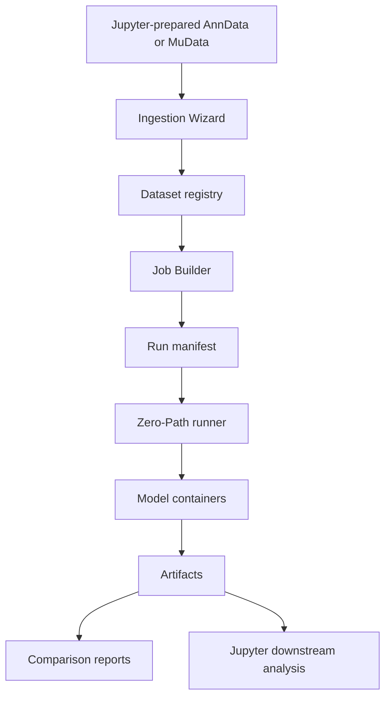

# Architecture

This explanation describes mvexp's architecture in researcher-facing terms. The purpose of the system is to make multimodal integration benchmarks reproducible while hiding infrastructure details from day-to-day scientific work.

## System Overview



## Main Components

| Component | Researcher-facing role |
|---|---|
| Ingestion Wizard | Visual data onboarding from prepared `.h5ad` or `.h5mu` files. |
| Registry | Catalog of datasets and models available for benchmarking. |
| Job Builder | Compatibility matrix for selecting dataset x model pairs. |
| Parameters tab | Reproducible parameter and sweep configuration. |
| Zero-Path runner | Executes models without exposing host file paths to the user. |
| Results tab | Metrics, logs, artifacts, and comparison reports. |
| MLflow/Optuna views | Experiment and sweep summaries when services are enabled. |

## Filesystem Layout

```text
store/
  datasets/<slug>/
    dataset.yaml
    data/
      *.h5ad or *.h5mu
  models/<slug>/
    model.yaml
    container/
  artifacts/<experiment>/<dataset>/<model>/<run_id>/
    run_manifest.yaml
    job_spec.json
    embeddings.h5
    metrics.json
    umap.png
    container.log
```

## Zero-Path Execution

```mermaid
flowchart LR
    A[Host dataset path] --> B[mvexp maps paths]
    B --> C[/input/data.h5mu]
    B --> D[/output/job_spec.json]
    C --> E[Model]
    D --> E
    E --> F[/output/embeddings.h5]
    E --> G[/output/metrics.json]
```

Models see only `/input/data.h5mu` and `/output/`. This keeps model execution consistent across datasets, machines, and collaborators.

## Provenance Model

Each result carries its own recipe:

| Artifact | Provenance value |
|---|---|
| `dataset.yaml` | What data and metadata were registered. |
| `run_manifest.yaml` | What benchmark was requested. |
| `job_spec.json` | What one model received at runtime. |
| `metrics.json` | What the model reported. |
| `container.log` | What happened during execution. |
| `provenance.json` | Additional run provenance when present. |

## Comparison Reports

Comparison reports combine metric outputs so researchers can rank models by scientific criteria, especially biological conservation and batch correction. This is more publication-ready than comparing isolated notebook outputs because the report links each metric to the exact run recipe.

[IMAGE: Results Tab Comparison Report]

## Common Errors

| Question | Answer |
|---|---|
| Why use a registry? | It prevents hidden notebook state from becoming the source of truth. |
| Why use containers? | They isolate model dependencies so one model's environment does not disturb another. |
| Why use Zero-Path? | It removes host-specific path assumptions from model code. |
| Why are artifacts immutable after success? | Published results should point to a stable recipe and output bundle. |

## Citation Note

When describing architecture in a paper, cite mvexp version/commit and state that each run was archived with its manifest, runtime spec, metrics, logs, and provenance artifacts.
