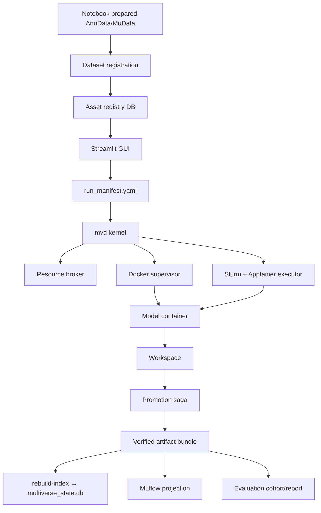

# Architecture

This page is the current system map for Multiverse.

## What the System Is

Multiverse is built around these pieces:

1. **Artifact store** under `store/`, which is the durable scientific record.
2. **mvd kernel**, which owns run state transitions, execution supervision (Docker or Slurm), cancellation, validation, and promotion.
3. **SQLite index** (`multiverse_state.db`), which gives the GUI fast registry/run listings and is rebuildable from the journal and artifact store.
4. **Asset registry** (`asset_registry.db`), which holds dataset and model catalog rows and is separate from the run index.
5. **Streamlit GUI**, which plans benchmarks and talks to the in-process mvd controller for execution.
6. **Projection services** such as MLflow and Optuna, which are useful comparison surfaces but not the source of run truth.

## System Diagram



## Repository Layout

```text
multiverse/
  gui.py                   Streamlit entry point
  cli_entrypoints.py       First-class maintenance CLI commands (doctor, rebuild-index, gc, slurm-submit, …)
  state_paths.py           M1 state-root resolver (MULTIVERSE_STATE_DIR > config > XDG > $HOME/.multiverse)
  runner/
    cli.py                 CLI parser: run, register-dataset, init-db, migrate-asset-registry, …
    mvd_entrypoint.py      Headless mvd-backed run bridge
    mvd_inprocess.py       GUI in-process mvd controller
  mvd/                     Kernel, state machine, executor interface
    docker_executor.py     MvdDockerExecutor (Docker path)
    slurm_executor.py      MvdSlurmExecutor (Slurm + Apptainer path)
    kernel.py              KernelConfig, run-state machine
  docker_supervisor/       Container engine protocol, RealDockerEngine, labels, leases, cancel saga
  slurm/                   SlurmEngine Protocol, RealSlurmEngine, InMemorySlurmEngine (fake)
  apptainer/               ApptainerEngine Protocol, RealApptainerEngine (with OOM detection)
  simple/                  Simple-mode runner: contract-only execution without mvd/SQLite/MLflow
  client/                  Line-delimited JSON protocol for kernel ↔ client RPC
  builder.py               Docker image build helper (NFS-safe tar, used by register-model --build)
  promotion/               Validation/promotion saga and quarantine helpers
  artifact/                Artifact manifest, checksums, validators, bundle writer
  evaluation/              Launch cohorts, readiness, Docker evaluation runner, reports
  journal/                 Append-only journal writer/reader
  index/                   SQLite rebuild support (multiverse_state.db — run index)
  index_projection.py      Read-only facade over the SQLite run index
  asset_registry.py        Canonical dataset/model catalog (asset_registry.db)
  registry_db.py           Legacy shim: kept for backward-compat monkey-patching in tests
  gc/ doctor/ projection/  Maintenance and projection commands
  registration/            Defensive registration checks

store/
  datasets/<slug>/         Dataset manifests and data files
  models/<slug>/           Model manifests and build contexts
  workspaces/              In-flight workspaces
  artifacts/               Promoted immutable run bundles
  quarantine/              Recovery evidence requiring user decision
```

## Artifact Store and SQLite

The artifact bundle is the scientific contract. A successful bundle includes `artifact_manifest.json` and `artifact_manifest.sha256`, plus validated artifact entries with checksums.

For Slurm runs, the manifest carries a **dual-digest pair**: the OCI registry digest of the source image and the sha256 of the SIF file that was physically executed. This ties the scientific result to both the registry provenance and the exact binary used on the cluster.

SQLite is split into two databases:

- **`multiverse_state.db`** — the rebuildable run index. It is allowed to be stale or lost; `multiverse rebuild-index` reconstructs run visibility from journals and artifact manifests without deleting result-like data. As of schema v4 it also holds a `reservation_events` table rebuilt from journal `RESERVATION_GRANTED` / `RESERVATION_RELEASED` records.
- **`asset_registry.db`** — the dataset and model catalog. Written only by `asset_registry.py`; never rebuilt from scratch (it is authoritative, not derived). Migrate from a pre-split install with `multiverse migrate-asset-registry`.

The sole-writer invariant (`test_sqlite_writer_isolation.py`) enforces that raw SQL mutations appear only in the designated writer modules (`index/`, `index_projection`, `asset_registry`, `registry_db`, `models_ingest`). This is a CI gate.

## Launch Evaluation

Each mvd-backed launch writes a cohort under `<output-dir>/.multiverse/launches/<launch_id>/`. The cohort records every planned member, including skipped/resumed members, submitted attempt IDs, artifact directories, dataset paths, `batch_key`, `label_key`, and requested metrics.

Evaluation is a separate containerized workflow. The host resolves readiness, writes a trimmed `eval_config.json` for ready members, mounts datasets/artifacts read-only and the output tree read-write, then runs `multiverse-evaluate`. The container writes `evaluations/<member_id>.json` files and a derived `evaluation_report.json` under the launch directory. scIB plots are stored under `plots/dataset_<dataset_slug>/`. Promoted artifact directories are not mutated by evaluation.

Readiness statuses (`ready`, `running`, `training_failed`, `cancelled`, `not_submitted`, `missing_artifact_dir`, `bad_artifact_manifest`, `no_embeddings`, `missing_dataset`, `unsupported_dataset`) are pre-evaluation. Evaluation statuses (`pending`, `running`, `done`, `training_failed`, `not_ready`, `no_embeddings`, `missing_dataset`, `bad_manifest`, `obs_mismatch`, `unsupported_dataset`, `evaluation_failed`) are per-member outcomes in the report.

## Container Boundary

Every model container uses the same contract:

| Path | Contents |
|---|---|
| `/input/data.h5mu` | Read-only dataset mount. |
| `/output/job_spec.json` | Runtime instruction: dataset slug, model version, hyperparameters, seed. |
| `/output/` | Writable model outputs. |

Host paths do not appear inside model code.

## Execution Ownership

The GUI and CLI do not directly supervise containers. They submit work through the mvd kernel path. The kernel composes:

- resource admission (broker);
- container launch/reconcile — via `RealDockerEngine` on workstations, or via `RealSlurmEngine` + `RealApptainerEngine` on HPC clusters;
- explicit state transitions with an append-only journal;
- cancellation saga;
- output validation;
- atomic promotion saga;
- projection status reporting.

The two executors have different defaults for image identity:

- **Docker executor** — `accept_degraded=True` by default. Locally-built images (`make build-pca`) are the normal development workflow; no OCI digest is expected. Pass `--strict` to opt into publication mode, which requires a registry digest.
- **Slurm executor** — `accept_degraded=False` by default. HPC runs should have a verified OCI source digest; a SIF of unknown provenance is genuinely degraded. Pass `--accept-degraded` if you need to run an unverified SIF.
