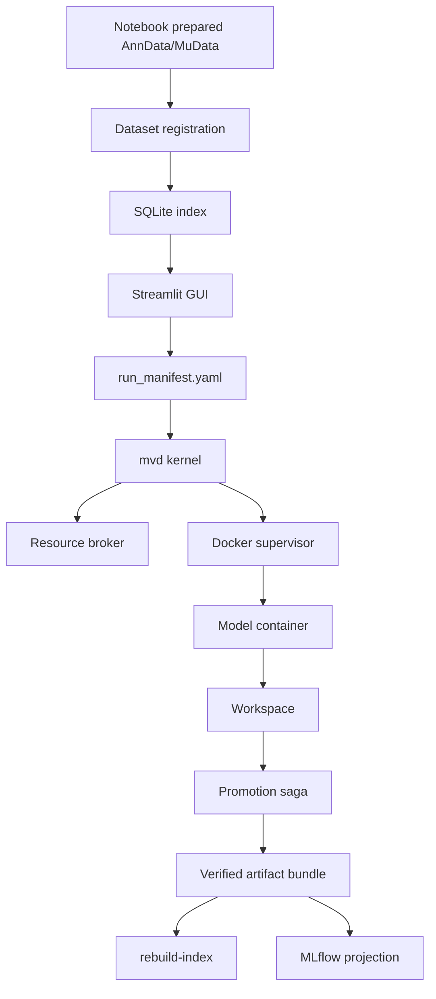

# Architecture

This page is the current system map for mvexp.

## What the System Is

mvexp is a local single-user application built around these pieces:

1. **Artifact store** under `store/`, which is the durable scientific record.
2. **mvd kernel**, which owns run state transitions, Docker supervision, cancellation, validation, and promotion.
3. **SQLite index** (`mvexp_state.db`), which gives the GUI fast registry/run listings and is rebuildable.
4. **Streamlit GUI**, which plans benchmarks and talks to the in-process mvd controller for execution.
5. **Projection services** such as MLflow and Optuna, which are useful comparison surfaces but not the source of run truth.

## System Diagram



## Repository Layout

```text
multiverse/
  gui.py                   Streamlit entry point
  runner/
    cli.py                 CLI parser and run/register commands
    mvd_entrypoint.py      Headless mvd-backed run bridge
    mvd_inprocess.py       GUI in-process mvd controller
    local_runner.py        Developer host-Python execution path
  mvd/                     Kernel, state machine, executor interface
  docker_supervisor/       Container engine protocol, RealDockerEngine, labels, leases, cancel saga
  promotion/               Validation/promotion saga and quarantine helpers
  artifact/                Artifact manifest, checksums, validators, bundle writer
  journal/                 Append-only journal writer/reader
  index/                   SQLite rebuild support
  gc/ doctor/ projection/  Maintenance and projection commands
  registration/            Defensive registration checks

store/
  datasets/<slug>/         Dataset manifests and data files
  models/<slug>/           Model manifests and build contexts
  workspaces/              In-flight workspaces
  artifacts/               Promoted immutable run bundles
  quarantine/              Recovery evidence requiring user decision
```

## Artifact Store and SQLite

The artifact bundle is the scientific contract. A successful bundle includes `artifact_manifest.json` and `artifact_manifest.sha256`, plus validated artifact entries with checksums.

SQLite is a rebuildable index. It is allowed to be stale or lost; `multiverse rebuild-index` should reconstruct visibility from journals and artifact manifests without deleting result-like data.

## Container Boundary

Every model container uses the same contract:

| Path | Contents |
|---|---|
| `/input/data.h5mu` | Read-only dataset mount. |
| `/output/job_spec.json` | Runtime instruction: dataset slug, model version, hyperparameters, seed. |
| `/output/` | Writable model outputs. |

Host paths do not appear inside model code.

## Execution Ownership

The GUI and CLI do not directly supervise Docker containers. They submit work through the mvd kernel path. The kernel composes:

- resource admission;
- Docker launch/reconcile through `RealDockerEngine`;
- explicit state transitions;
- cancellation saga;
- output validation;
- atomic promotion saga;
- projection status reporting.

## Observability

MLflow and Optuna are projections. They can be offline without invalidating a promoted artifact bundle. Sync failures should surface as projection status, not as scientific run failure.

## Why This Design

| Question | Answer |
|---|---|
| Why per-model containers? | Single-cell integration methods have conflicting ML stacks; containers isolate them. |
| Why mvd instead of Streamlit subprocesses? | Run lifetime and browser/session lifetime are different; the kernel owns execution. |
| Why artifact manifests? | They make results portable, verifiable, and rebuildable without trusting SQLite. |
| Why SQLite at all? | It provides fast local indexing and registry queries without a server. |
| Why MLflow as projection? | Dashboards are useful for comparison, but artifact bundles are the durable Methods record. |
