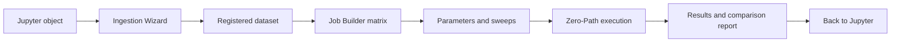

# Benchmarking

This how-to explains how to run and interpret model benchmarks in mvexp. It is written for researchers who want the benchmark to be reproducible, not for users who want to manage execution infrastructure by hand.

## What Benchmarking Means in mvexp

A benchmark is a comparison of dataset x model runs under a recorded recipe. You choose the biology: dataset, models, metadata keys, parameters, metrics, and seed. mvexp handles execution, artifact capture, and comparison reports.

[IMAGE: The Job Builder Matrix]



## Tutorial: Run a First Benchmark

1. Open the Streamlit GUI.
2. Open the **Registry** tab.
3. Expand **Register New Dataset**.
4. Use the **Ingestion Wizard** fields or provide a `dataset.yaml` path.
5. Click **Register Dataset**.
6. Click **Refresh Registry**.
7. Open the **Job Builder** tab.
8. Review the compatibility matrix.
9. Select the dataset x model pairs you want to compare.
10. Click **Generate Run Manifest**.
11. Open the **Parameters** tab.
12. Adjust model hyperparameters or enable Optuna sweep controls.
13. Click **Generate Run Manifest (with params)**.
14. Open the **Execute** tab.
15. Confirm the manifest path and random seed.
16. Click **Launch Run**.
17. Open the **Results** tab after completion.
18. Review metrics, logs, artifacts, and comparison outputs.

## How-To: Choose a Benchmark Design

### One Dataset, Many Models

Use this when asking which integration model best represents one biological dataset.

Typical examples:

- RNA+ATAC PBMC multiome: compare PCA, MOFA, MultiVI, Mowgli, and Cobolt.
- CITE-seq RNA+ADT: compare TotalVI against simpler baselines.
- Atlas subset: compare models on the same donor/site metadata.

### One Model, Many Datasets

Use this when asking whether a model is robust across cohorts, tissues, donors, or technologies. Register each dataset separately so each has its own `dataset.yaml`, metadata keys, and preprocessing record.

### Parameter Sweeps

Use the **Parameters** tab when you want Optuna to search over ranges. The GUI reads each model's hyperparameter schema and turns it into typed controls, so you do not need to hand-write search-space YAML.

[IMAGE: Parameter Sweep Controls]

## Reference: Benchmark Artifacts

Every successful run is promoted to an artifact directory similar to:

```text
store/artifacts/<experiment>/<dataset>/<model>/<run_id>/
  run_manifest.yaml
  job_spec.json
  embeddings.h5
  metrics.json
  umap.png
  container.log
```

| File | Why it matters |
|---|---|
| `run_manifest.yaml` | The benchmark recipe: datasets, models, parameters, metrics, seed, and experiment name. |
| `job_spec.json` | The exact per-run instruction passed to the model. |
| `embeddings.h5` | The latent representation used for evaluation and downstream notebook work. |
| `metrics.json` | Model-level diagnostics and metric histories where available. |
| `umap.png` | Quick visual check of the learned representation. |
| `container.log` | Human-readable execution log for troubleshooting and peer review. |
| `provenance.json` | Run provenance when present; include it with supplementary materials. |

## Explanation: Zero-Path Execution

Zero-Path execution means model containers do not know or care where files live on your computer. mvexp gives every model the same simple view:

- input data appears at `/input/data.h5mu`;
- runtime instructions appear at `/output/job_spec.json`;
- results are written to `/output/`.

For researchers, this means fewer path errors, no hand-written container commands, and comparable runs across models.

## Comparison Reports

The Results tab and MLflow views help compare models across biological conservation and batch-correction metrics. Use comparison reports to rank models by the metrics relevant to the manuscript, not by training loss alone.

[IMAGE: Comparison Report Ranking Models]

Good interpretation practice:

- rank models separately for bio-conservation and batch correction;
- inspect both groups together before choosing a model;
- treat missing metrics as metadata information, not just missing numbers;
- bring selected embeddings back into Jupyter for biological validation plots.

## Common Errors

| Symptom | Likely cause | What to do |
|---|---|---|
| Job status is `SKIPPED` | Dataset lacks required omics for that model. | Choose a compatible model or register a dataset with the needed modality. |
| Job status is `FAILED` before training | `batch_key` is missing from `.obs` or the data file cannot be read. | Check the Ingestion Wizard metadata keys and reopen the data in Jupyter. |
| Supervised metrics are absent | `cell_type_key` was not registered or is absent from `.obs`. | Add a stable biological label column and re-register the dataset. |
| Batch metrics are absent | Only one batch is present, or `batch_key` is absent. | Confirm that the batch column contains at least two meaningful groups. |
| UMAP has no colors | `umap_color_type` does not match a column in `.obs`. | Set it to a valid metadata column such as `cell_type`. |
| Model ranking looks surprising | One metric family may improve while another declines. | Compare bio-conservation and batch-correction metrics together. |

## How to Cite mvexp

Until a formal publication is available, cite the software repository and archive the exact version used. Include the commit hash, `run_manifest.yaml`, and run provenance with the Supplementary Material.

Suggested wording:

```text
Integration benchmarks were executed with mvexp (version/commit: <commit>). The full
benchmark recipe, including datasets, models, hyperparameters, random seed, and requested
metrics, is provided as Supplementary File X (`run_manifest.yaml`). Per-run provenance and
model outputs are provided with the archived artifacts.
```
