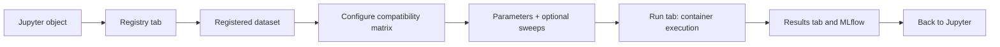

# Benchmarking

This how-to explains how to run and interpret model benchmarks in Multiverse.

## What Benchmarking Means in multiverse

A benchmark is a comparison of dataset x model runs under a recorded recipe. You choose the biology: dataset, models, metadata keys, parameters, metrics, and seed. Multiverse handles execution, artifact capture, and comparison reports.



## Tutorial: Run a First Benchmark

1. Open the Streamlit GUI.
2. **Registry** → **Register New Dataset** → either enter the path to your `dataset.yaml` or fill the form. Click **Register Dataset**, then **Refresh Registry**.
3. **Configure** → review the compatibility matrix; only `Compatible` cells are selectable.
4. Select the dataset × model pairs you want to compare.
5. Adjust hyperparameters in the per-row forms. Toggle Optuna sweep controls if `globals.run_gridsearch: true`.
6. Enter an experiment name and a random seed; click **Generate Run Manifest**.
7. **Run** → confirm the manifest path and click **Launch Run**. Watch the status table.
8. **Run** → when jobs reach `ARTIFACT_SUCCESS`, use **Evaluate Experiment** to compute scIB metrics in the evaluation container.
9. **Results** → review model metrics, logs, artifacts, and the evaluation comparison view.
10. **Analysis** → open the embedded MLflow and Optuna dashboards for cross-run analysis.

## How-To: Choose a Benchmark Design

### One Dataset, Many Models

Use this when asking which integration model best represents one biological dataset.

### One Model, Many Datasets

Use this when asking whether a model is robust across cohorts, tissues, donors, or technologies. Register each dataset separately so each has its own `dataset.yaml`, metadata keys, and preprocessing record.

### Parameter Sweeps

Set `globals.run_gridsearch: true` in the manifest (or toggle the sweep controls in **Configure**) and the runner delegates each job to Optuna. The GUI reads each model's hyperparameter schema and renders typed sweep controls — you do not need to hand-write a search-space YAML. Trials appear as child runs of the parent MLflow run, and the Optuna Dashboard at `http://localhost:28080` visualizes parameter importance and pruning.

## Reference: Benchmark Artifacts

Every successful run is promoted to an artifact directory similar to:

```text
<output-dir>/store/artifacts/<artifact-id>/
  artifact_manifest.json
  artifact_manifest.sha256
  job_spec.json
  embeddings.h5
  metrics.json        # optional
  metrics.jsonl       # optional
  umap.png            # optional
  run.log             # model SDK log (multiverse.worker)
  container.log       # host-captured container stdout/stderr
  orchestrator.log    # host-side run reasoning
```

| File | Why it matters |
|---|---|
| `artifact_manifest.json` | Durable bundle metadata: run IDs, dataset fingerprint, image identity, checksums, and validated artifact entries. |
| `artifact_manifest.sha256` | Sidecar checksum for the artifact manifest. |
| `job_spec.json` | The exact per-run instruction passed to the model. |
| `embeddings.h5` | The latent representation used for evaluation and downstream notebook work. |
| `metrics.json` | Model-level diagnostics and final metric histories where available. |
| `metrics.jsonl` | One JSON row per epoch (step, timestamp, metrics) when the model uses `EpochLogger`. Survives crashes. |
| `umap.png` | Quick visual check of the learned representation. |
| `run.log` | Model SDK log written inside the container. |
| `container.log` | Host-captured container stdout/stderr; survives early crashes and OOMs. |
| `orchestrator.log` | Host-side per-run log: admission, launch, exit classification, promotion outcome, failure reason. |
| `provenance.json` | Run provenance when present; include it with supplementary materials. |

## Live Training Metrics

Each containerized model run first produces a verified local artifact bundle. MLflow is then used as a projection for comparison and dashboarding. A run can be scientifically successful (`ARTIFACT_SUCCESS`) even if MLflow sync is pending or failed. When sync is available, it captures four kinds of data:

- **Hyperparameters and tags** — logged at run start by the host so they appear in MLflow before training begins.
- **System metrics** — sampled by MLflow's built-in monitor while the parent run is open, which is exactly the duration the container is alive.
- **Per-epoch metrics** — streamed from inside the container by `EpochLogger` (see [Adding a Model](ADDING_A_MODEL.md#live-per-epoch-metrics-optional-but-recommended)) when the model exposes them. 
- **Final scalars and artifacts** — appended by the host after the container exits, then the run is ended with `FINISHED` or `FAILED` status.
> **Rebuild after editing a model container or `multiverse.worker`.** The SDK is `COPY`'d into each image at build time, so changes only take effect after rebuilding (`docker compose build <model>`).

## Evaluating an Experiment

Training produces per-model embeddings; **evaluation** scores those embeddings against each other with the scIB metric suite. Evaluation is launch-scoped: each time you launch a run, Multiverse records a **cohort** — the full set of dataset × model members for that launch — and evaluation operates on that cohort.

### The Evaluate Experiment section

After launching from the **Run** tab, an **Evaluate Experiment** section appears below **Launch & Monitor**. It is disk-backed (it reloads from the launch cohort on every render, so it survives a browser refresh) and works as follows:

1. **Readiness resolution.** Every cohort member is resolved to a readiness status — whether its training artifact is present and evaluable. The per-member table shows the dataset, model, source, artifact directory, status, and reason.
2. **Gating.** The **Evaluate experiment** button is enabled once at least one member is `ready`.
3. **Containerized evaluation.** Clicking the button builds (if needed) and runs the `multiverse-evaluate` image. The container reads a trimmed, ready-members-only config, runs one grouped scIB benchmark per dataset, and writes a structured result for every member.
4. **Comparison table.** When evaluation finishes, the section renders a launch-level comparison table — one row per member with its evaluation status and scIB metrics — plus the scIB plot per dataset.

Re-running evaluation is idempotent: members already recorded as `done` for the same artifact directory are skipped and their results are preserved. To re-score them, tick **Re-evaluate completed members** in the GUI or pass `--force` to `multiverse evaluate` (distinct from the image-rebuild force).

> **Rebuild the evaluation image after editing `multiverse/evaluate.py` (or `multiverse.worker`).** The package is `pip install`'d into `multiverse-evaluate` at build time, so source changes only take effect after `make build-evaluate` (or ticking **Force rebuild evaluation image** in the GUI). A stale image surfaces as missing CLI flags (e.g. `unrecognized arguments: --force`) or old output paths.

### Readiness statuses (pre-evaluation gate)

| Status | Meaning |
|---|---|
| `ready` | Artifact present and verified; member can be evaluated. |
| `running` | Training has not reached a terminal state yet. |
| `training_failed` | Training ended in a failed terminal state. |
| `cancelled` | The run was cancelled. |
| `not_submitted` | The member was never submitted in this launch. |
| `missing_artifact_dir` / `no_embeddings` | Artifact directory or `embeddings.h5` is absent. |
| `bad_artifact_manifest` | Artifact manifest checksum verification failed. |
| `missing_dataset` / `unsupported_dataset` | Dataset path is missing or not `.h5ad`/`.h5mu`. |

### Evaluation statuses (per-member outcome)

Each evaluated member gets a structured outcome rather than a silent empty result:

| Status | Meaning |
|---|---|
| `pending` | Evaluable, but not yet evaluated. |
| `running` | Evaluation in progress (also the on-crash state). |
| `done` | Completed and produced metrics. |
| `obs_mismatch` | Latent rows do not match dataset observations. |
| `no_embeddings` | `embeddings.h5` was absent at evaluation time. |
| `missing_dataset` | Dataset could not be loaded. |
| `evaluation_failed` | scIB raised or returned unusable output for that member. |
| `training_failed` / `not_ready` / `bad_manifest` / `unsupported_dataset` | Projected from readiness for members that never reached the evaluator. |

A failure in one member never aborts the others — the cohort is evaluated member by member.

The registered `cell_type_key` (and `batch_key`) flow from the dataset registry through the cohort into the benchmark as scIB's `label_key`/`batch_key`. See [Evaluation Metrics](reference/EVALUATION_METRICS.md) for what each metric measures and when it is skipped.

## Reference: Evaluation Outputs

Evaluation writes only under the launch directory — it never mutates promoted artifact bundles (which would invalidate their checksums):

```text
<output-dir>/.multiverse/launches/<launch_id>/
  cohort.json                  # launch membership (all dataset x model members)
  manifest.yaml                # copy of the launched manifest
  eval_config.json             # trimmed, ready-members-only config fed to the container
  evaluation_report.json       # launch-level aggregation (see below)
  evaluations/
    <member_id>.json           # one structured result per cohort member
  plots/
    dataset_<name>/scib_results.svg
```

| File | Why it matters |
|---|---|
| `cohort.json` | Authoritative launch membership: every member, its source, artifact dir, and resolved `label_key`/`batch_key`. |
| `evaluations/<member_id>.json` | Per-member outcome: `status`, `reason`, `artifact_dir`, `dataset_path`, `started_at`, `finished_at`, `duration_seconds`, `metrics`, and structured `error` on failure. Enables per-member failure tracking and re-run skipping. |
| `evaluation_report.json` | Derived launch-level aggregation: launch metadata, `readiness_counts`, `status_counts`, and a flattened per-member table. Rebuilt from the per-member files after each run; it is the source the GUI comparison table reads. |
| `plots/dataset_<name>/scib_results.svg` | The scIB results plot for each dataset. |

Use the comparison table and `evaluation_report.json` to rank models by the metrics relevant to the manuscript, not by training loss alone. The `launch_id` (`<manifest_prefix>_<backend>_seed<seed>_<timestamp>_<nonce>`) makes each launch's evaluation independently inspectable and archivable.

