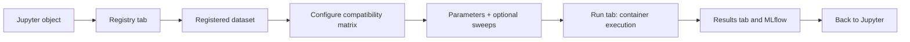

# Benchmarking

This how-to explains how to run and interpret model benchmarks in Multiverse.

## What Benchmarking Means in mvexp

A benchmark is a comparison of dataset x model runs under a recorded recipe. You choose the biology: dataset, models, metadata keys, parameters, metrics, and seed. Multiverse handles execution, artifact capture, and comparison reports.



## Tutorial: Run a First Benchmark

1. Open the Streamlit GUI.
2. **Registry** → **Register New Dataset** → either enter the path to your `dataset.yaml` or fill the form. Click **Register Dataset**, then **Refresh Registry**.
3. **Configure** → review the compatibility matrix; only `Compatible` cells are selectable.
4. Select the dataset × model pairs you want to compare.
5. Adjust hyperparameters in the per-row forms. Toggle Optuna sweep controls if `globals.run_gridsearch: true`.
6. Enter an experiment name and a random seed; click **Generate Run Manifest**.
7. **Run** → confirm the manifest path and click **Launch Run**. Watch the status table.
8. **Results** → review metrics, logs, artifacts, and the comparison view.
9. **Analysis** → open the embedded MLflow and Optuna dashboards for cross-run analysis.

## How-To: Choose a Benchmark Design

### One Dataset, Many Models

Use this when asking which integration model best represents one biological dataset.

### One Model, Many Datasets

Use this when asking whether a model is robust across cohorts, tissues, donors, or technologies. Register each dataset separately so each has its own `dataset.yaml`, metadata keys, and preprocessing record.

### Parameter Sweeps

Set `globals.run_gridsearch: true` in the manifest (or toggle the sweep controls in **Configure**) and the runner delegates each job to Optuna. The GUI reads each model's hyperparameter schema and renders typed sweep controls — you do not need to hand-write a search-space YAML. Trials appear as child runs of the parent MLflow run, and the Optuna Dashboard at `http://localhost:28080` visualizes parameter importance and pruning.

## Reference: Benchmark Artifacts

Every successful run is promoted to an artifact directory similar to:

```text
<output-dir>/store/artifacts/<artifact-id>/
  artifact_manifest.json
  artifact_manifest.sha256
  job_spec.json
  embeddings.h5
  metrics.json        # optional
  metrics.jsonl       # optional
  umap.png            # optional
  run.log             # model SDK log (mvr_worker)
  container.log       # host-captured container stdout/stderr
  orchestrator.log    # host-side run reasoning
```

| File | Why it matters |
|---|---|
| `artifact_manifest.json` | Durable bundle metadata: run IDs, dataset fingerprint, image identity, checksums, and validated artifact entries. |
| `artifact_manifest.sha256` | Sidecar checksum for the artifact manifest. |
| `job_spec.json` | The exact per-run instruction passed to the model. |
| `embeddings.h5` | The latent representation used for evaluation and downstream notebook work. |
| `metrics.json` | Model-level diagnostics and final metric histories where available. |
| `metrics.jsonl` | One JSON row per epoch (step, timestamp, metrics) when the model uses `EpochLogger`. Survives crashes. |
| `umap.png` | Quick visual check of the learned representation. |
| `run.log` | Model SDK log written inside the container. |
| `container.log` | Host-captured container stdout/stderr; survives early crashes and OOMs. |
| `orchestrator.log` | Host-side per-run log: admission, launch, exit classification, promotion outcome, failure reason. |
| `provenance.json` | Run provenance when present; include it with supplementary materials. |

## Live Training Metrics

Each containerized model run first produces a verified local artifact bundle. MLflow is then used as a projection for comparison and dashboarding. A run can be scientifically successful (`ARTIFACT_SUCCESS`) even if MLflow sync is pending or failed. When sync is available, it captures four kinds of data:

- **Hyperparameters and tags** — logged at run start by the host so they appear in MLflow before training begins.
- **System metrics** — sampled by MLflow's built-in monitor while the parent run is open, which is exactly the duration the container is alive.
- **Per-epoch metrics** — streamed from inside the container by `EpochLogger` (see [Adding a Model](ADDING_A_MODEL.md#live-per-epoch-metrics-optional-but-recommended)) when the model exposes them. 
- **Final scalars and artifacts** — appended by the host after the container exits, then the run is ended with `FINISHED` or `FAILED` status.
> **Rebuild after editing a model container or `mvr_worker`.** The SDK is `COPY`'d into each image at build time, so changes only take effect after rebuilding (`docker compose build <model>`).

## Comparison Reports

The Results tab and MLflow views help compare models across biological conservation and batch-correction metrics. Use comparison reports to rank models by the metrics relevant to the manuscript, not by training loss alone.

TODO: [IMAGE: Comparison Report Ranking Models]

