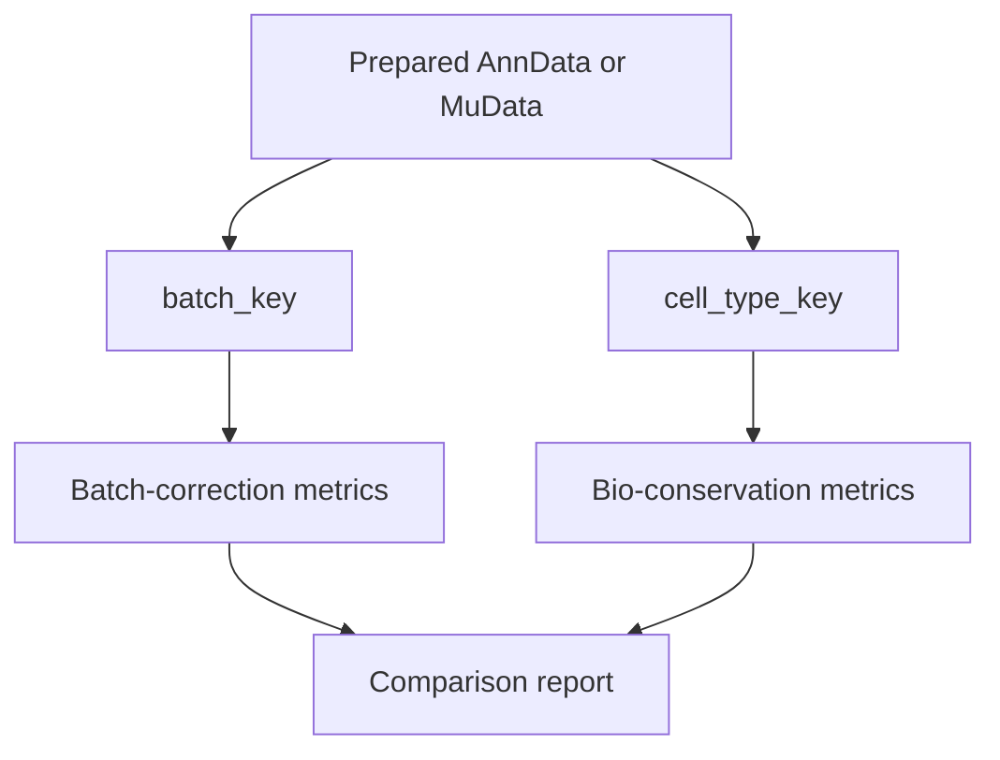

# Data Registration

This how-to explains how to make a prepared dataset visible to mvexp through the Streamlit **Registry** tab. The CLI equivalent is `make register slug=<slug>` (or `python -m multiverse.runner.cli register-dataset --slug <slug>`).

Use [Data Preparation](DATA_PREPARATION.md) for notebook-side formatting details. This page focuses on onboarding the prepared files into the platform.

## What Registration Does

Registration tells mvexp:

- what the dataset is called;
- which modalities are available;
- where the prepared files live;
- which `.obs` column is the batch key;
- which `.obs` column is the cell-type key.

Registration does not change your biology. It creates a reproducible dataset record for benchmarking.

[IMAGE: Registry Tab Ingestion Wizard]

## Tutorial: Register a Dataset Visually

1. Start mvexp and open the Streamlit GUI.
2. Open the **Registry** tab.
3. Expand **Register New Dataset**.
4. Switch on **Build manifest from fields** if you do not already have a `dataset.yaml`.
5. Enter a descriptive dataset name, for example `PBMC Multiome RNA+ATAC`.
6. Select available omics: `rna`, `atac`, `adt`, or `other`.
7. Enter the path to each prepared `.h5ad` or `.h5mu` file.
8. Enter `batch_key`, for example `donor_id`, `sample`, or `chemistry`.
9. Enter `cell_type_key`, for example `cell_type`, `annotation`, or `cell_ontology_class`.
10. Click **Register Dataset**.
11. Click **Refresh Registry**.
12. Confirm the dataset appears with status `READY`.

## Hello World Dataset

Minimal RNA-only dataset manifest:

```yaml
name: "Hello PBMC RNA"
omics: ["rna"]
raw_files:
  rna: "data/rna.h5ad"
metadata_keys:
  batch: "batch"
  cell_type: "cell_type"
```

Folder layout:

```text
store/datasets/hello_pbmc/
  dataset.yaml
  data/
    rna.h5ad
```

Notebook-side sanity check:

```python
import scanpy as sc

adata = sc.read_h5ad("store/datasets/hello_pbmc/data/rna.h5ad")
assert "batch" in adata.obs
assert "cell_type" in adata.obs
assert adata.n_obs > 0
assert adata.n_vars > 0
```

## Reference: `dataset.yaml` Fields

| Field | Required | Meaning | Example |
|---|---|---|---|
| `name` | Yes | Human-readable dataset name. | `PBMC Multiome RNA+ATAC` |
| `omics` | Yes | Modalities available in the dataset. | `["rna", "atac"]` |
| `raw_files` | Yes | Mapping from modality to file path relative to the dataset folder. | `rna: "data/rna.h5ad"` |
| `metadata_keys.batch` | Recommended | `.obs` column used for batch-correction metrics. | `donor_id` |
| `metadata_keys.cell_type` | Optional | `.obs` column used for supervised bio-conservation metrics. | `cell_type` |

## Explanation: Why Metadata Keys Matter

The same embedding can look good or bad depending on the biological question. `batch_key` tells mvexp which technical or donor grouping should be mixed. `cell_type_key` tells mvexp which biological labels should be preserved.



## Common Errors

| Symptom | Likely cause | What to do |
|---|---|---|
| Dataset does not appear after registration | Registry view is cached. | Click **Refresh Registry**. |
| Registration fails with missing file | `raw_files` path is wrong. | Make paths relative to `store/datasets/<slug>/`. |
| Batch metrics are skipped | Batch column missing or has one value. | Check `adata.obs[batch_key].value_counts()` in Jupyter. |
| Label metrics are skipped | `cell_type_key` missing or misspelled. | Confirm the column name exactly matches `.obs`. |
| A model is incompatible | Dataset modalities do not match model requirements. | Choose a compatible model in Configure. |

## How to Cite Registered Data

For publications, archive the `dataset.yaml` file with the notebook that produced the `.h5ad` or `.h5mu`. In Methods, report the matrix state, filtering, normalization, batch key, and cell-type key.
