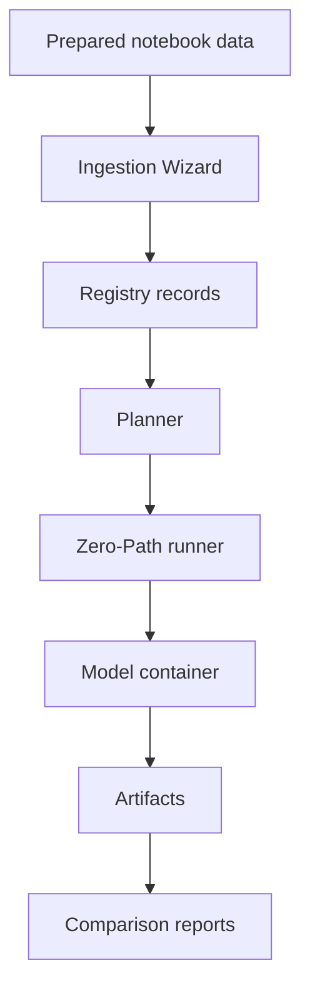

# Developer Guide

This explanation is for maintainers extending mvexp. It is intentionally separate from the researcher tutorials: implementation detail should support the GUI-first workflow, not replace it.

## Maintainer Mental Model

## Core Boundaries

| Boundary | Contract |
|---|---|
| Dataset ingestion | `dataset.yaml` plus prepared `.h5ad` or `.h5mu`. |
| Model registration | `model.yaml` plus hyperparameter schema. |
| Runtime | `/input/data.h5mu`, `/output/job_spec.json`, `/output/`. |
| Evaluation | `embeddings.h5` and metadata keys determine valid metrics. |
| Reporting | Metrics and artifacts are tied back to the run recipe. |

## Development Priorities

1. Preserve reproducibility artifacts.
2. Keep normal researcher workflows visual and sequential.
3. Make errors actionable in the GUI.
4. Keep model interfaces language-agnostic.
5. Prefer explicit metadata over hidden notebook state.

## Reference: Dataset Package

| Path | Purpose |
|---|---|
| `store/datasets/<slug>/dataset.yaml` | Dataset metadata and modality/file mapping. |
| `store/datasets/<slug>/data/` | Prepared input files. |

## Reference: Model Package

| Path | Purpose |
|---|---|
| `store/models/<slug>/model.yaml` | Model metadata and runtime image. |
| `schemas/models/<slug>.hyperparameters.schema.json` | GUI and sweep parameter contract. |
| `store/models/<slug>/container/` | Runtime packaging. |

## Common Errors

| Issue | Maintainer response |
|---|---|
| Researchers see stack traces | Convert expected failures into clear status messages. |
| A feature requires hand-written paths | Move path handling into registry or Zero-Path mapping. |
| Metrics disappear silently | Report why the metric was skipped. |
| Docs mention old commands | Rewrite around GUI actions and maintainer-only references. |

## Citation and Release Practice

For academic adoption, releases should make citation easy. Tag versions, keep changelogs, and ensure run artifacts include enough information to cite the exact software state used in a manuscript.
