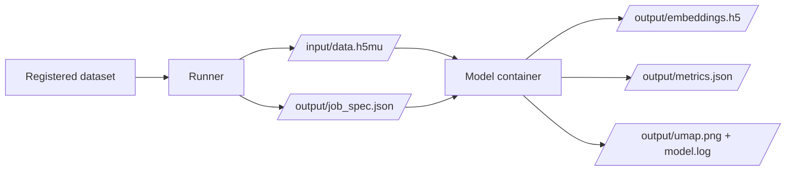

# Model Containers

mvexp runs every integration model in its own Docker container. The container boundary is what makes the platform reproducible across hosts and what isolates incompatible ML dependency stacks (scvi-tools, MOFA, Mowgli, Cobolt) from each other.

This page is a short orientation. The two canonical references are:

- [Model Container Contract](MODEL_CONTAINER_CONTRACT.md) — the I/O specification every image must honour.
- [Adding a Model](ADDING_A_MODEL.md) — how to author and register a new image.

## The Idea in One Diagram

Each container reads `/input/data.h5mu` plus `/output/job_spec.json`, then writes its outputs under `/output/`. No host path appears in model code, so the same image runs unchanged on a laptop, an HPC node, and a CI runner.

## Build Pattern

All built-in images use a `mambaorg/micromamba` base, install a conda environment from the model's `environment.yml`, then install the `mvr-worker` SDK from the repository's `sdk/mvr-worker/` directory. The build context is the repository root; this is what allows the Dockerfile to `COPY sdk/mvr-worker/ /tmp/mvr-worker/`.

See [Model Container Contract — Build Pattern](MODEL_CONTAINER_CONTRACT.md#build-pattern) for the canonical template.

## Built-in Images

| Slug | Image | Modalities | Notes |
|---|---|---|---|
| `pca` | `multiverse-pca:1.0.0` | RNA | Linear baseline via Scanpy. |
| `mofa` | `multiverse-mofa:1.0.0` | Any | MOFA+ multi-factor decomposition. |
| `multivi` | `multiverse-multivi:1.0.0` | RNA + ATAC | scvi-tools-based VAE. |
| `totalvi` | `multiverse-totalvi:1.0.0` | RNA + ADT | scvi-tools protein-aware VAE. |
| `mowgli` | `multiverse-mowgli:1.0.0` | RNA + ATAC | Optimal transport-based factor model. |
| `cobolt` | `multiverse-cobolt:1.0.0` | RNA + ATAC | VAE from epurdom/cobolt. |

Build any image locally with `make build-<slug>`. Build them all (and the evaluation image) with `make build-all`.

## Why Containerize at All

For a platform engineer the answer is dependency isolation: a single Python environment cannot host scvi-tools, MOFA, Mowgli, and Cobolt without conflicts, and the GPU stacks each library targets are mutually exclusive on a single host install.

For a bioinformatics user the answer is more practical: every benchmark you launch records the exact image tag it ran against, and that tag is part of the run's `job_spec.json` and the MLflow tags. Reproducing a published result is then a question of pulling the recorded image, not of recreating a conda environment from memory.
