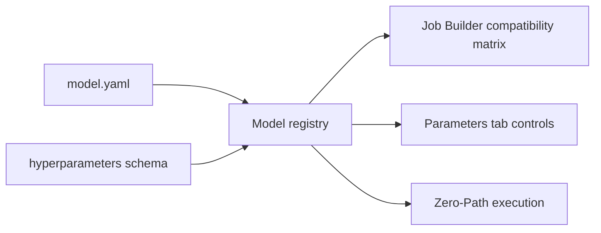

# Model Registration

This reference is for model authors and platform maintainers. Researchers using built-in models usually do not need this page; they select models visually in the GUI.

## What Model Registration Does

Model registration tells mvexp which models exist, which omics they support, which container image to run, and which hyperparameters should appear in the GUI.

[IMAGE: Registry Tab Model Table]



## Hello World Model Package

```text
store/models/hello_pca/
  model.yaml
  container/
    Dockerfile
    environment.yml
schemas/models/hello_pca.hyperparameters.schema.json
```

Minimal `model.yaml`:

```yaml
name: HelloPCA
version: 1.0.0
contract_version: 1.0.0
supported_omics: ["rna"]
runtime:
  image: mvexp-hello-pca:1.0.0
hyperparameters_schema: schemas/models/hello_pca.hyperparameters.schema.json
build:
  context: ../../..
  dockerfile: store/models/hello_pca/container/Dockerfile
```

Minimal hyperparameter schema:

```json
{
  "$schema": "https://json-schema.org/draft/2020-12/schema",
  "title": "HelloPCA Hyperparameters",
  "type": "object",
  "properties": {
    "n_components": {"type": "integer", "minimum": 2, "default": 20},
    "device": {"type": "string", "enum": ["cpu", "cuda", "cuda:0"], "default": "cpu"}
  },
  "additionalProperties": false
}
```

## Reference: `model.yaml` Fields

| Field | Required | Meaning | Example |
|---|---|---|---|
| `name` | Yes | Human-readable model name shown in the GUI. | `PCA` |
| `version` | Yes | Model package version. | `1.0.0` |
| `contract_version` | Yes | Zero-Path contract version. | `1.0.0` |
| `supported_omics` | Yes | Modalities required by the model. | `["rna", "atac"]` |
| `runtime.image` | Yes | Container image used by the runner. | `multiverse-pca:1.0.0` |
| `hyperparameters_schema` | Recommended | JSON schema used to render GUI controls and Optuna sweep ranges. | `schemas/models/pca.hyperparameters.schema.json` |
| `build.context` | Optional | Build context for maintainers who build images locally. | `../../..` |
| `build.dockerfile` | Optional | Dockerfile path relative to the build context. | `store/models/pca/container/Dockerfile` |

## How-To: Add a Model Without Breaking the GUI

1. Create `store/models/<slug>/model.yaml`.
2. Add a hyperparameter schema under `schemas/models/<slug>.hyperparameters.schema.json`.
3. Ensure the container follows the [Model Container Contract](MODEL_CONTAINER_CONTRACT.md).
4. Register the model through the **Registry** tab.
5. Click **Refresh Registry**.
6. Confirm it appears in the Models table.
7. Open **Job Builder** and check that compatibility is correct.
8. Open **Parameters** and confirm the expected controls appear.

## Explanation: Why Schemas Matter

The schema is not just validation. It is the bridge between model code and a notebook-first user experience. A clear schema lets mvexp show sliders, numeric inputs, and sweep controls instead of asking researchers to hand-edit model configuration.

## Common Errors

| Symptom | Likely cause | What to do |
|---|---|---|
| Model appears but has no parameter controls | `hyperparameters_schema` path is missing or invalid. | Check the schema path and JSON syntax. |
| Model is never compatible | `supported_omics` does not match dataset modalities. | Use modality names such as `rna`, `atac`, and `adt`. |
| Run fails immediately | Container does not follow Zero-Path. | Read `/input/data.h5mu`, read `/output/job_spec.json`, write `/output/`. |
| GUI field has wrong type | JSON schema type is wrong. | Use `integer`, `number`, `string`, `boolean`, or `enum`. |

## Citation Note

For papers using custom models, cite the model method separately and archive the `model.yaml`, hyperparameter schema, container version, and mvexp run artifacts.
