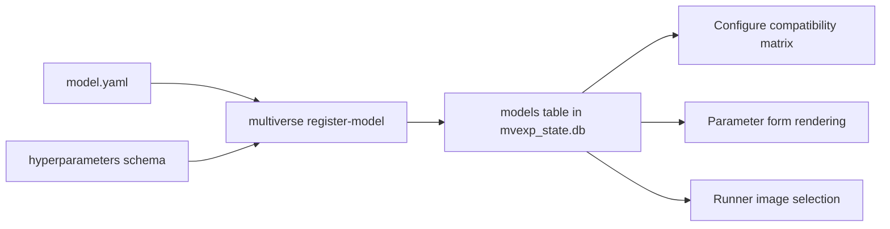

# Model Registration

This reference describes the registration step that makes a containerized model visible to the runner and to the GUI. It is intended for model authors and platform maintainers; researchers using built-in models do not normally need this page.

## What Registration Does

Registration writes a row into the `models` table of `mvexp_state.db` based on a manifest under `store/models/<slug>/model.yaml`. The row records the model's display name, version, contract version, required omics, runtime image, and the path to a JSON schema describing its hyperparameters. The Configure tab in the GUI uses this row to compute the compatibility matrix and to render typed parameter controls.



## Package Layout

```text
store/models/<slug>/
  model.yaml
  container/
    Dockerfile
    environment.yml
    run.py
schemas/models/<slug>.hyperparameters.schema.json
```

## Registering a Model

From the host:

```bash
make register-model slug=<slug>
# or, against a manifest at an explicit path
make register-model manifest=/path/to/model.yaml
```

The Makefile delegates to the CLI:

```bash
uv run python -m multiverse register-model --slug <slug>
```

The six built-in models (`pca`, `mofa`, `multivi`, `mowgli`, `cobolt`, `totalvi`) are registered automatically by `make bootstrap`.

## `model.yaml` Schema

| Field | Required | Meaning |
|---|---|---|
| `name` | yes | Display name in the GUI (e.g. `PCA`). |
| `version` | yes | Semantic version of the model package. |
| `contract_version` | yes | Container I/O contract version; currently `1.0.0`. |
| `supported_omics` | yes | List of modality slugs the model requires: `rna`, `atac`, `adt`. |
| `runtime.image` | yes | Image tag invoked by the mvd Docker executor (e.g. `multiverse-pca:1.0.0`). |
| `hyperparameters_schema` | recommended | Path (repo-relative) to the JSON schema used to render controls and validate sweep ranges. |
| `build.context` | optional | Build context for local image builds; typically `../../..` (repo root). |
| `build.dockerfile` | optional | Dockerfile path relative to the build context. |

Example (`store/models/pca/model.yaml`):

```yaml
name: PCA
version: 1.0.0
contract_version: 1.0.0
supported_omics:
  - rna
runtime:
  image: multiverse-pca:1.0.0
hyperparameters_schema: schemas/models/pca.hyperparameters.schema.json
build:
  context: ../../..
  dockerfile: store/models/pca/container/Dockerfile
```

## Hyperparameter Schema

The schema is a JSON Schema (draft 2020-12) document. Each property in the schema becomes a control in the Configure tab.

```json
{
  "$schema": "https://json-schema.org/draft/2020-12/schema",
  "title": "PCA Hyperparameters",
  "type": "object",
  "properties": {
    "n_components": {
      "type": "integer", "minimum": 2, "maximum": 200, "default": 50,
      "x-sweepable": true
    },
    "device": {
      "type": "string", "enum": ["cpu", "cuda", "cuda:0"], "default": "cpu"
    }
  },
  "additionalProperties": false
}
```

Supported types: `integer`, `number`, `string`, `boolean`. Use `enum` for closed sets. The non-standard `x-sweepable: true` annotation enables the sweep toggle next to the field when `globals.run_gridsearch: true` is set in the manifest.

## Verifying a Registration

After registering, in the GUI:

1. Open the **Registry** tab.
2. Click **Refresh Registry**.
3. Confirm the model appears in the Models table with the expected version and image.
4. Open **Configure**, pick a compatible dataset, and confirm parameter controls render.

From the CLI:

```bash
uv run python -c "from multiverse.registry_db import list_models; print(list_models())"
```

## Image Build

The orchestrator pulls images from your local Docker daemon. For development you typically build locally:

```bash
make build-<slug>      # e.g. make build-pca
make build-all         # build every built-in image plus the evaluation image
```

Built images follow the micromamba pattern documented in [Model Container Contract](MODEL_CONTAINER_CONTRACT.md). The `mvr-worker` SDK is copied from `sdk/mvr-worker/` into every image at build time, so any change to the SDK requires rebuilding the model images.

## Common Issues

| Symptom | Likely cause | What to do |
|---|---|---|
| Model has no parameter controls | `hyperparameters_schema` path missing or schema invalid. | Validate the JSON; ensure the path is repo-relative. |
| Model is never `Compatible` | `supported_omics` does not match any registered dataset. | Use canonical slugs: `rna`, `atac`, `adt`. |
| Runner fails with `image not found` | Image tag in `runtime.image` does not exist on the daemon. | `docker images | grep <slug>`; run `make build-<slug>`. |
| Model row marked `STALE` | `model.yaml` edited after registration. | Re-register: `make register-model slug=<slug>`. |
