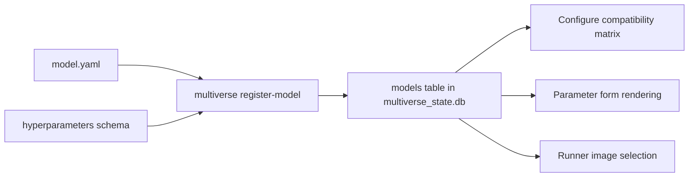

# Model Registration

This reference describes the registration step that makes a containerized model visible to the runner and to the GUI. It is intended for model authors and platform maintainers; researchers using built-in models do not normally need this page.

## What Registration Does

Registration writes a row into the `models` table of `multiverse_state.db` based on a manifest under `store/models/<slug>/model.yaml`. The row records the model's display name, version, contract version, required omics, runtime image, and the path to a JSON schema describing its hyperparameters. The Configure tab in the GUI uses this row to compute the compatibility matrix and to render typed parameter controls.



## Package Layout

```text
store/models/<slug>/
  model.yaml
  hyperparameters.schema.json
  container/
    Dockerfile
    environment.yml
    run.py
```

The shared base schema lives at `schemas/hyperparameters.schema.json`.

## Registering a Model

From the host:

```bash
make register-model slug=<slug>
# or, against a manifest at an explicit path
make register-model manifest=/path/to/model.yaml
```

The Makefile delegates to the canonical CLI:

```bash
uv run multiverse register-model --slug <slug>
uv run multiverse register-model --manifest /path/to/model.yaml
uv run multiverse register-model --slug <slug> --build
```

The six built-in models (`pca`, `mofa`, `multivi`, `mowgli`, `cobolt`, `totalvi`) are registered automatically by `make bootstrap`.

## `model.yaml` Schema

At least one of `runtime` (Docker) or `apptainer` (SIF) must be present; a model that supports both execution paths can declare both.

| Field | Required | Meaning |
|---|---|---|
| `name` | yes | Display name in the GUI (e.g. `PCA`). |
| `version` | yes | Semantic version of the model package. |
| `contract_version` | yes | Container I/O contract version; currently `1.0.0`. |
| `supported_omics` | yes | List of modality slugs the model requires: `rna`, `atac`, `adt`. Use `["any"]` for a modality-agnostic model that runs on any dataset (see note below). |
| `runtime.image` | yes (Docker) | Image tag invoked by the mvd Docker executor (e.g. `multiverse-pca:1.0.0`). Required for Docker-path runs; omit if the model is SIF-only. |
| `apptainer.sif_path` | optional | Absolute or state-relative path to a pre-built `.sif` file. Set automatically by `multiverse build-sif`. |
| `apptainer.def_file` | optional | Repo-relative path to a `Singularity.def` file. Used by `multiverse build-sif --method def-file`. |
| `apptainer.gpu_required` | optional | Boolean; request `--nv` when running under Apptainer (default `false`). |
| `hyperparameters_schema` | recommended | Path (repo-relative) to the JSON schema used to render controls and validate sweep ranges. |
| `preprocessing` | optional | Default preprocessing parameters (`n_top_genes`, `normalization_target_sum`, `log_normalization`, per-modality `scale`). Any field omitted falls back to the container's built-in default. See note below. |
| `build.context` | optional | Build context for local Docker image builds; typically `../../..` (repo root). |
| `build.dockerfile` | optional | Dockerfile path relative to the build context. |

Example — Docker-only model (`store/models/pca/model.yaml`):

```yaml
name: PCA
version: 1.0.0
contract_version: 1.0.0
supported_omics:
  - rna
runtime:
  image: multiverse-pca:1.0.0
hyperparameters_schema: store/models/pca/hyperparameters.schema.json
build:
  context: ../../..
  dockerfile: store/models/pca/container/Dockerfile
```

Example — Apptainer-only model (HPC-first, no Docker daemon required):

```yaml
name: MyHPCModel
version: 1.0.0
contract_version: 1.0.0
supported_omics:
  - rna
apptainer:
  def_file: store/models/my_hpc_model/container/Singularity.def
  gpu_required: true
hyperparameters_schema: store/models/my_hpc_model/hyperparameters.schema.json
```

#### Preprocessing parameters

Preprocessing is configurable at two levels (issue #22):

- **Model defaults** — declare a `preprocessing` block in `model.yaml`:

  ```yaml
  preprocessing:
    n_top_genes: 2000
    normalization_target_sum: 10000
    log_normalization: true
    scale:
      rna: false
      atac: true
  ```

- **Per-run overrides** — set `jobs[].preprocessing` in the run manifest, or use
  the **Preprocessing overrides** controls in the GUI Configure tab. These are
  written into the container's `/output/job_spec.json` and merged over the
  model defaults at run time.

Any field left unset falls back to the container's built-in default, so
existing models keep working without changes. `scale` accepts either a
per-modality mapping or a single boolean applied to all modalities.

#### Modality-agnostic models

A model that does not depend on any particular modality (for example a generic
dimensionality-reduction method that operates on whatever feature matrices a
dataset provides) can declare:

```yaml
supported_omics:
  - any
```

`["any"]` marks the model as compatible with **every** registered dataset in
the compatibility matrix. The validator rejects mixing `any` with concrete
modalities — `["any", "rna"]` is an error. Use either a concrete modality list
or exactly `["any"]`, never both.

## Hyperparameter Schema

The schema is a JSON Schema (draft 2020-12) document. Each property in the schema becomes a control in the Configure tab.

```json
{
  "$schema": "https://json-schema.org/draft/2020-12/schema",
  "title": "PCA Hyperparameters",
  "type": "object",
  "properties": {
    "n_components": {
      "type": "integer", "minimum": 2, "maximum": 200, "default": 50,
      "x-sweepable": true
    },
    "device": {
      "type": "string", "enum": ["cpu", "cuda", "cuda:0"], "default": "cpu"
    }
  },
  "additionalProperties": false
}
```

Supported types: `integer`, `number`, `string`, `boolean`. Use `enum` for closed sets. The non-standard `x-sweepable: true` annotation enables the sweep toggle next to the field when `globals.run_gridsearch: true` is set in the manifest.

## Verifying a Registration

After registering, in the GUI:

1. Open the **Registry** tab.
2. Click **Refresh Registry**.
3. Confirm the model appears in the Models table with the expected version and image.
4. Open **Configure**, pick a compatible dataset, and confirm parameter controls render.

From the CLI:

```bash
uv run python -c "from multiverse.registry_db import list_models; print(list_models())"
```

## Image Build

### Docker images

The orchestrator pulls images from your local Docker daemon. For development you typically build locally:

```bash
make build-<slug>      # e.g. make build-pca
make build-all         # build every built-in image plus the evaluation image
```

Built images follow the micromamba pattern documented in [Model Container Contract](MODEL_CONTAINER_CONTRACT.md). The `multiverse[worker]` SDK is installed from the repository-root build context into every image at build time, so any change to the SDK requires rebuilding the model images.

### SIF files (Apptainer / Singularity)

To run a model on an HPC cluster via `multiverse slurm-submit`, you need a SIF file. `multiverse build-sif` converts the model's Dockerfile or Singularity.def into a SIF and records the path in the registry:

```bash
# From a Dockerfile (docker-daemon method requires Docker running locally)
multiverse build-sif --slug pca --output-dir /scratch/images/

# From a Singularity.def (def-file method; no Docker daemon required)
multiverse build-sif --slug my_hpc_model --method def-file --output-dir /scratch/images/
```

The method is auto-detected from `model.yaml`: if `build.dockerfile` is set, `docker-daemon` is used; if `apptainer.def_file` is set, `def-file` is used. Once built, the SIF path is stored in `asset_registry.db` and can be passed to `multiverse slurm-submit --image-sif <path>`.

## Common Issues

| Symptom | Likely cause | What to do |
|---|---|---|
| Model has no parameter controls | `hyperparameters_schema` path missing or schema invalid. | Validate the JSON; ensure the path is repo-relative. |
| Model is never `Compatible` | `supported_omics` does not match any registered dataset. | Use canonical slugs: `rna`, `atac`, `adt`. |
| Runner fails with `image not found` | Image tag in `runtime.image` does not exist on the daemon. | `docker images | grep <slug>`; run `make build-<slug>`. |
| Model row marked `STALE` | `model.yaml` edited after registration. | Re-register: `make register-model slug=<slug>` or `uv run multiverse register-model --slug <slug>`. |
