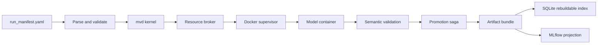

# Runner & Orchestration

This page documents the current execution path for turning `run_manifest.yaml` into validated artifact bundles.

## Entry Points

| Surface | Command | Notes |
|---|---|---|
| Canonical CLI (Docker) | `multiverse run --manifest <path> --output <dir>` | Installed command; delegates to the mvd-backed Docker runner. |
| Canonical CLI (Slurm) | `multiverse slurm-submit --model-slug <slug> --image-sif <path> [--image-digest sha256:…]` | Submit a single job through the Slurm + Apptainer path. |
| Source checkout | `uv run multiverse run --manifest <path> --output <dir>` | Same Docker run path without installing the package globally. |
| Compatibility CLI | `python -m multiverse.runner.cli run --manifest <path> --output <dir>` | Kept for compatibility; prefer `multiverse`. |
| GUI | Streamlit **Run** tab | Submits to the in-process mvd controller; it does not spawn the runner as a subprocess. |
| Maintenance | `multiverse doctor`, `multiverse rebuild-index`, `multiverse gc --dry-run`, `multiverse mlflow-sync`, `multiverse migrate-asset-registry` | Recovery and projection commands. Use `uv run multiverse ...` from a source checkout. |

## Execution Pipelines

### Docker (default)



1. **Parse and validate.** The manifest is checked against the local registry before any run is submitted.
2. **Submit to mvd.** The CLI and GUI submit jobs through the kernel/client boundary. The kernel owns state transitions, cancellation, and execution tasks.
3. **Launch Docker through the supervisor.** The supervisor labels containers, records launch intent in the journal, and polls through the `RealDockerEngine` adapter.
4. **Write the model contract.** Each workspace receives `job_spec.json`; the container sees `/input/data.h5mu`, `/output/job_spec.json`, and `/output/`.
5. **Validate outputs.** Successful container exit is not enough. Required artifacts are opened and checked before promotion.
6. **Promote through a saga.** The workspace is staged under an owned staging directory and atomically renamed into the artifact store only after validation.
7. **Project to MLflow.** MLflow is a projection. A valid artifact bundle can be scientifically successful even if tracking sync is pending or failed.

### Slurm + Apptainer

On HPC clusters without Docker, use the Slurm path:

```bash
uv run multiverse slurm-submit \
  --model-slug pca \
  --image-sif /scratch/images/multiverse-pca-1.0.0.sif \
  --image-digest sha256:<oci-digest> \
  --params-json '{"n_components": 20}' \
  --output store/artifacts/run_output
```

The Slurm executor:

- Submits an `sbatch` script that calls `apptainer exec` against the provided SIF.
- Computes a sha256 digest of the SIF file at submission time and records both the OCI source digest (`image_digest`) and the local SIF digest as a **dual-digest pair** in the artifact manifest. This ties the scientific result to the exact binary that ran.
- Follows the same validation + promotion saga as the Docker path; the artifact bundle format is identical.

`--image-digest` is optional but strongly recommended. When supplied, the resulting manifest carries both `registry_digest` (the OCI source) and `sif_digest` (what was physically executed), satisfying the M2 dual-digest invariant. Without it, the source identity is recorded as `unverified_local` and `--accept-degraded` is required to proceed.

## Run States

| State | Meaning |
|---|---|
| `PENDING` / `ADMITTED` | The kernel accepted the run and is preparing execution. |
| `RUNNING` | The model container is active. |
| `TRAINING_SUCCEEDED` / `EVALUATING` | The container exited zero and post-run checks are in progress. |
| `PROMOTING` | Validated outputs are being promoted into the artifact store. |
| `ARTIFACT_SUCCESS` | The promoted bundle is the durable scientific result. |
| `FAILED` | Execution failed before a valid artifact was promoted. |
| `CANCELLED` | The user cancelled the run; workspace evidence is preserved. |
| `RECOVERY_PENDING` | The run needs explicit user/operator recovery or adoption. |

## Artifact Contract

Every successful run must contain a verified `artifact_manifest.json` and `artifact_manifest.sha256`. The manifest records logical and physical run IDs, dataset fingerprint, image identity, parameter hash, timestamps, owner token, and validated artifact entries with checksums.

SQLite is an index over this state, not the scientific source of truth. If the SQLite file is lost, `multiverse rebuild-index` reconstructs run visibility from the journal and artifact store. For the default tutorial output directory, use:

```bash
uv run multiverse rebuild-index \
  --state-root store/artifacts/run_output \
  --store-root store/artifacts/run_output/store
```

## Required Outputs

| Artifact | Description |
|---|---|
| `artifact_manifest.json` + `.sha256` | Verified bundle metadata and checksum sidecar. |
| `job_spec.json` | Exact runtime instruction passed to the model container. |
| `embeddings.h5` | Required latent matrix at HDF5 dataset `latent`. |
| `metrics.json` | Optional model diagnostics and metric summaries. |
| `umap.png` | Optional visualization. |
| `run.log` | Model SDK log written inside the container by `mvr_worker`. |
| `container.log` | Host-captured container stdout/stderr; present even when the container crashed before writing `run.log`. |
| `orchestrator.log` | Host-side per-run log: admission, launch, exit classification, promotion outcome, and failure reason. |

Logs for a run that fails before promotion remain in its workspace at `<state-root>/store/workspaces/<attempt-id>/`. Set `MVEXP_LOG_LEVEL=DEBUG` to raise verbosity across the host logs and the in-container `run.log`.

The full I/O contract is documented in [Model Container Contract](MODEL_CONTAINER_CONTRACT.md).

## Image Identity and Publication Mode

The two execution backends have different defaults because their typical workflows differ.

### Docker (local development)

Locally-built images — `make build-pca`, `docker build ...` — have no OCI registry digest. This is the normal workflow for researchers. The Docker executor accepts these images by default and records their identity as `unverified_local` in the artifact manifest.

For a publication-quality run where you want the manifest to prove exactly which registry-published image ran, pass `--strict`:

```bash
uv run multiverse run --manifest run_manifest.yaml --output store/artifacts/run_output --strict
```

`--strict` rejects any image that cannot be traced to a registry digest. Use this only when you have pushed and pulled your model images from a registry.

### Slurm + Apptainer

On HPC, the expectation is reversed: you typically pull a known image from a registry and convert it to a SIF, so the Slurm executor requires a verifiable source by default.

To run with a SIF that has no known registry provenance (e.g. a SIF built manually outside the pipeline), pass `--accept-degraded`:

```bash
uv run multiverse slurm-submit ... --accept-degraded
```

## Asset Registry Migration

If you are upgrading from a prior version that stored dataset and model records in the combined `mvexp_state.db`, run the one-time migration:

```bash
uv run multiverse migrate-asset-registry
# or dry-run to see what would be copied:
uv run multiverse migrate-asset-registry --dry-run
```

This copies dataset and model rows from `mvexp_state.db` into the new dedicated `asset_registry.db`. The migration refuses to run twice (idempotent guard). After migration, `mvexp_state.db` continues to hold run/index state; `asset_registry.db` holds the dataset and model catalog.

## Troubleshooting

| Symptom | Likely cause | What to do |
|---|---|---|
| Launch fails before container start | Manifest references stale dataset/model rows. | Regenerate the manifest from Configure or re-register the stale object. |
| `executor crashed: unverified_local` | Running Docker path with `--strict` but image has no registry digest. | Remove `--strict` (the default is open for local builds). Slurm path: pass `--accept-degraded` if the SIF has no OCI source. |
| Run reaches `FAILED` | Container non-zero exit, Docker launch failure, or validator refusal. | Open the artifact/workspace logs and inspect `failure_reason`. |
| Run reaches `RECOVERY_PENDING` | Promotion or recovery found data that requires user decision. | Use recovery/quarantine reports before deleting anything. |
| MLflow has no successful entry | Projection sync is pending or failed. | The artifact bundle is still authoritative; run `multiverse mlflow-sync` later. |
| SQLite state looks wrong | Index drift or DB loss. | Run `multiverse rebuild-index` against the state and store roots. |
| `multiverse run` cannot import Docker SDK | The active environment was not synced from project dependencies. | Run `uv sync --group dev`, or install the package with its declared dependencies. |
| `migrate-asset-registry` says "already migrated" | Migration ran once already. | Nothing to do; `asset_registry.db` is up to date. |
