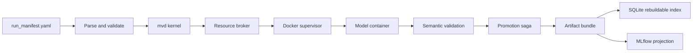

# Runner & Orchestration

This page documents the current execution path for turning `run_manifest.yaml` into validated artifact bundles.

## Entry Points

| Surface | Command | Notes |
|---|---|---|
| Canonical CLI | `multiverse run --manifest <path> --output <dir>` | Installed command; delegates to the mvd-backed runner. |
| Source checkout | `uv run multiverse run --manifest <path> --output <dir>` | Same run path without installing the package globally. |
| Compatibility CLI | `python -m multiverse.runner.cli run --manifest <path> --output <dir>` | Kept for compatibility; prefer `multiverse`. |
| GUI | Streamlit **Run** tab | Submits to the in-process mvd controller; it does not spawn the runner as a subprocess. |
| Maintenance | `multiverse doctor`, `multiverse rebuild-index`, `multiverse gc --dry-run`, `multiverse mlflow-sync` | Recovery and projection commands. Use `uv run multiverse ...` from a source checkout. |

## Execution Pipeline



1. **Parse and validate.** The manifest is checked against the local registry before any run is submitted.
2. **Submit to mvd.** The CLI and GUI submit jobs through the kernel/client boundary. The kernel owns state transitions, cancellation, and execution tasks.
3. **Launch Docker through the supervisor.** The supervisor labels containers, records launch intent in the journal, and polls through the `RealDockerEngine` adapter.
4. **Write the model contract.** Each workspace receives `job_spec.json`; the container sees `/input/data.h5mu`, `/output/job_spec.json`, and `/output/`.
5. **Validate outputs.** Successful container exit is not enough. Required artifacts are opened and checked before promotion.
6. **Promote through a saga.** The workspace is staged under an owned staging directory and atomically renamed into the artifact store only after validation.
7. **Project to MLflow.** MLflow is a projection. A valid artifact bundle can be scientifically successful even if tracking sync is pending or failed.

## Run States

| State | Meaning |
|---|---|
| `PENDING` / `ADMITTED` | The kernel accepted the run and is preparing execution. |
| `RUNNING` | The model container is active. |
| `TRAINING_SUCCEEDED` / `EVALUATING` | The container exited zero and post-run checks are in progress. |
| `PROMOTING` | Validated outputs are being promoted into the artifact store. |
| `ARTIFACT_SUCCESS` | The promoted bundle is the durable scientific result. |
| `FAILED` | Execution failed before a valid artifact was promoted. |
| `CANCELLED` | The user cancelled the run; workspace evidence is preserved. |
| `RECOVERY_PENDING` | The run needs explicit user/operator recovery or adoption. |

## Artifact Contract

Every successful run must contain a verified `artifact_manifest.json` and `artifact_manifest.sha256`. The manifest records logical and physical run IDs, dataset fingerprint, image identity, parameter hash, timestamps, owner token, and validated artifact entries with checksums.

SQLite is an index over this state, not the scientific source of truth. If the SQLite file is lost, `multiverse rebuild-index` reconstructs run visibility from the journal and artifact store. For the default tutorial output directory, use:

```bash
uv run multiverse rebuild-index \
  --state-root store/artifacts/run_output \
  --store-root store/artifacts/run_output/store
```

## Required Outputs

| Artifact | Description |
|---|---|
| `artifact_manifest.json` + `.sha256` | Verified bundle metadata and checksum sidecar. |
| `job_spec.json` | Exact runtime instruction passed to the model container. |
| `embeddings.h5` | Required latent matrix at HDF5 dataset `latent`. |
| `metrics.json` | Optional model diagnostics and metric summaries. |
| `umap.png` | Optional visualization. |
| `container.log` | Captured model output when available. |

The full I/O contract is documented in [Model Container Contract](MODEL_CONTAINER_CONTRACT.md).

## Local Execution

`--local` remains a developer/debug path for running Python model wrappers on the host. Production benchmark execution should use the default mvd-backed Docker path.

## Troubleshooting

| Symptom | Likely cause | What to do |
|---|---|---|
| Launch fails before container start | Manifest references stale dataset/model rows. | Regenerate the manifest from Configure or re-register the stale object. |
| Run reaches `FAILED` | Container non-zero exit, Docker launch failure, or validator refusal. | Open the artifact/workspace logs and inspect `failure_reason`. |
| Run reaches `RECOVERY_PENDING` | Promotion or recovery found data that requires user decision. | Use recovery/quarantine reports before deleting anything. |
| MLflow has no successful entry | Projection sync is pending or failed. | The artifact bundle is still authoritative; run `multiverse mlflow-sync` later. |
| SQLite state looks wrong | Index drift or DB loss. | Run `multiverse rebuild-index` against the state and store roots. |
| `multiverse run` cannot import Docker SDK | The active environment was not synced from project dependencies. | Run `uv sync --group dev`, or install the package with its declared dependencies. |
