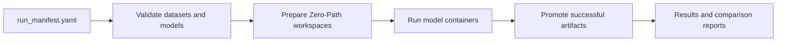

# Runner

This reference explains what the runner does behind the GUI. Most researchers should launch runs from the Streamlit **Execute** tab, not by calling runner modules directly.

## What the Runner Does

The runner turns a GUI-generated benchmark plan into reproducible model executions.

## Tutorial: Use the Runner Through the GUI

1. Open **Job Builder**.
2. Select compatible dataset x model pairs.
3. Click **Generate Run Manifest**.
4. Open **Parameters**.
5. Set fixed parameters or sweep ranges.
6. Click **Generate Run Manifest (with params)**.
7. Open **Execute**.
8. Confirm the manifest path and seed.
9. Click **Launch Run**.
10. Monitor the status table.

[IMAGE: Execute Tab Run Status]

## Reference: Run States

| State | Meaning |
|---|---|
| `QUEUED` | The job is planned but has not started. |
| `RUNNING` | The model is training or writing outputs. |
| `SUCCESS` | Required artifacts were written and promoted. |
| `FAILED` | The job started but did not complete successfully. |
| `SKIPPED` | mvexp did not run the job because validation found a known issue. |

## Reference: Required Successful Outputs

| Artifact | Description |
|---|---|
| `embeddings.h5` | Latent matrix with HDF5 dataset `latent`. |
| `metrics.json` | Model-level metrics and optional histories. |
| `job_spec.json` | Exact runtime instruction passed to the model. |
| `run_manifest.yaml` | Copy of the benchmark recipe. |
| `container.log` | Execution log. |

## Explanation: Why This Improves Reproducibility

A notebook cell can be changed and re-run without leaving a complete record. mvexp turns the benchmark plan into artifacts that travel with the result. The combination of `run_manifest.yaml`, `job_spec.json`, metrics, logs, and provenance files gives reviewers a concrete recipe rather than only prose.

## Common Errors

| Question | Answer |
|---|---|
| Why is my job `FAILED`? | Open the Results tab, select the failed run, and inspect the error or `container.log`. Common causes are unreadable data, missing metadata, or model-specific input requirements. |
| Why is my job `SKIPPED`? | The validation step found a predictable issue before training, such as incompatible omics or missing `batch_key`. |
| Why are some metrics missing? | The dataset metadata did not support them, or the model did not produce the required output. |
| Can I re-run with the same seed? | Yes. Keep the same manifest and seed to reproduce the same planned benchmark. |

## How to Cite a Run

Cite the archived artifact directory and include `run_manifest.yaml` plus provenance files as Supplementary Material. State the mvexp version or commit used for the run.
