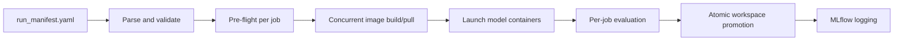

# Runner & Orchestration

This page documents the orchestration layer that turns a `run_manifest.yaml` into a set of executed model runs with archived artifacts. It is written for operators and developers; bioinformatics users typically interact with the runner through the **Run** tab in the [GUI](GUI.md).

## Entry Points

| Surface | Command | Notes |
|---|---|---|
| CLI | `python -m multiverse.runner.cli run --manifest <path> --output <dir>` | Canonical headless entry point. |
| Makefile | `make benchmark MANIFEST=run_manifest.yaml OUTPUT_DIR=./results` | Convenience wrapper around the CLI. |
| GUI | Streamlit **Run** tab | Spawns the CLI as a subprocess and consumes its JSON event stream. |

The CLI lives in `multiverse/runner/cli.py`. It additionally exposes `init-db`, `register-dataset`, and `register-model` subcommands; see [Model Registration](MODEL_REGISTRATION.md) and [Data Registration](DATA_REGISTRATION.md) for those.

## Execution Pipeline

1. **Parse and validate.** The manifest is parsed into a `ParsedManifest` dataclass with an explicit error list. Unknown model names, missing dataset slugs, or malformed parameter blocks are surfaced before any container starts.
2. **Pre-flight per job.** For each job, `validate_pending_jobs()` confirms that the registered dataset exposes the omics required by the model, that the requested batch and cell-type keys exist, and that requested metrics are computable. Jobs failing pre-flight transition to `SKIPPED` with a reason recorded.
3. **Concurrent image build/pull.** `build_images_concurrently()` pulls or builds every required image in parallel, so the first job is not blocked on a sequential cold start.
4. **Launch model containers.** `runner.docker_runner.run_model_container()` mounts the dataset at `/input/data.h5mu` and an ephemeral workspace at `/output`, injects `MLFLOW_TRACKING_URI` and a deterministic seed, then supervises the container with `_supervise_container()`. Concurrency is bounded by an asyncio semaphore informed by available host RAM.
5. **Per-job evaluation.** Successful model containers are followed by an evaluation container (`docker-env/evaluation.Dockerfile`) that reads the embedding, applies `multiverse.evaluate.determine_valid_metrics()`, and writes `metrics.json` augmented with scib-metrics outputs.
6. **Atomic workspace promotion.** `run_and_promote()` moves the workspace directory to `store/artifacts/<experiment>/<dataset>/<model>/<run_id>/` and then writes `status=SUCCESS` to the `runs` table. The DB write occurs after the move so that a crash mid-promotion cannot orphan a successful run.
7. **MLflow logging.** Successful runs are logged to MLflow through `multiverse.tracking.log_successful_run_to_mlflow()`. Parent and child runs are nested so that sweeps produced by Optuna remain comparable in the MLflow UI.

## Run States

| State | Meaning |
|---|---|
| `PENDING` | The job is in the plan but has not started. |
| `RUNNING` | The model container is training or writing outputs. |
| `SUCCESS` | Required artifacts were written, validated, and promoted. |
| `FAILED` | The container exited non-zero or output validation failed. |
| `SKIPPED` | Pre-flight rejected the job before any container was launched. |

States are persisted in the `runs` table of `mvexp_state.db` and streamed live to the GUI as JSON events on stderr.

## Concurrency Model

The SQLite registry is opened with `PRAGMA journal_mode = WAL`, `PRAGMA synchronous = NORMAL`, and a 30-second busy timeout. Writes from the Streamlit process, the runner, and tooling can therefore proceed concurrently without lock-thrashing.

Container parallelism is bounded by an asyncio semaphore in `docker_runner`. The default limit is derived from available host RAM; override with `MVEXP_MAX_PARALLEL_JOBS` if you need to pin a value (for example on a shared GPU node).

## Required Outputs

A successful run produces:

| Artifact | Description |
|---|---|
| `embeddings.h5` | Latent matrix exposed as HDF5 dataset `latent`. |
| `metrics.json` | Model-level metrics and (optional) training history. |
| `job_spec.json` | Exact runtime instruction passed to the model container. |
| `run_manifest.yaml` | Copy of the benchmark recipe. |
| `umap.png` | UMAP visualization rendered by the model container. |
| `container.log` | Stdout/stderr captured from the container. |

The full I/O contract is documented in [Model Container Contract](MODEL_CONTAINER_CONTRACT.md).

## Local (Non-Docker) Execution

`multiverse/runner/local_runner.py` provides a pure-Python fallback that loads the dataset in-process, instantiates the model class directly, and writes the same artifact set. It is used by the unit tests and is convenient for debugging model code without a Docker round-trip, but it bypasses the container isolation that makes the platform reproducible across hosts. Production runs should use the Docker path.

## Sweeps

When `globals.run_gridsearch: true` is set in the manifest, the runner delegates to `multiverse/runner/tuner.py`. Each job becomes an Optuna study; the `objective()` callable samples hyperparameters from the manifest's distribution spec, executes the job, and returns the target metric. Trials are logged as child runs under the parent MLflow run, and the Optuna Dashboard at `http://localhost:8080` visualizes parameter importance and pruning.

## Troubleshooting

| Symptom | Likely cause | What to do |
|---|---|---|
| Job `SKIPPED` immediately | Pre-flight validation failed. | Inspect the runner log for the reason; usually a missing column or omics mismatch. |
| Container exits with `ImportError` for `mvr_worker` | Model image was rebuilt without the SDK. | Rebuild with the standard Dockerfile pattern; see [Adding a Model](ADDING_A_MODEL.md). |
| Orphaned workspace under `store/workspaces/` | The runner crashed between container completion and promotion. | Workspaces are safe to delete; the artifact tree is the source of truth. |
| `database is locked` persisting | A second process holds a long write transaction. | `lsof mvexp_state.db` to identify; WAL mode handles transient contention automatically. |
| MLflow has no entry for a successful run | `MLFLOW_TRACKING_URI` unreachable from the runner. | Verify `make services-up` succeeded and the URI matches. |
