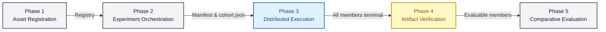
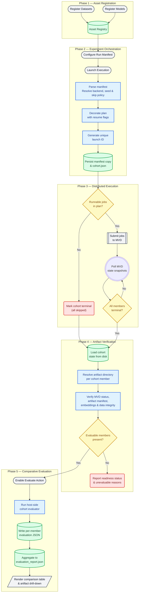

```mermaid
flowchart LR

classDef uiAction  fill:#f3f4f6,stroke:#4b5563,stroke-width:2px,color:#111827
classDef compute   fill:#e0f2fe,stroke:#2563eb,stroke-width:2px,color:#1e3a8a
classDef decision  fill:#fef9c3,stroke:#ca8a04,stroke-width:2px,color:#854d0e
classDef artifact  fill:#dcfce7,stroke:#16a34a,stroke-width:2px,color:#14532d
classDef terminal  fill:#fee2e2,stroke:#dc2626,stroke-width:2px,color:#7f1d1d

P1["Phase 1\nAsset Registration"]
P2["Phase 2\nExperiment Orchestration"]
P3["Phase 3\nDistributed Execution"]
P4["Phase 4\nArtifact Verification"]
P5["Phase 5\nComparative Evaluation"]

P1 -->|Registry| P2
P2 -->|Manifest & cohort.json| P3
P3 -->|All members terminal| P4
P4 -->|Evaluable members| P5

class P1,P2,P5 uiAction
class P3 compute
class P4 decision
```
---

```mermaid
flowchart TD

%% ── Style Classes ────────────────────────────────────────────
classDef uiAction  fill:#f3f4f6,stroke:#4b5563,stroke-width:2px,color:#111827
classDef compute   fill:#e0f2fe,stroke:#2563eb,stroke-width:2px,color:#1e3a8a
classDef decision  fill:#fef9c3,stroke:#ca8a04,stroke-width:2px,color:#854d0e
classDef artifact  fill:#dcfce7,stroke:#16a34a,stroke-width:2px,color:#14532d
classDef terminal  fill:#fee2e2,stroke:#dc2626,stroke-width:2px,color:#7f1d1d

%% ── Phase 1: Asset Registration ──────────────────────────────
subgraph Phase1["Phase 1 — Asset Registration"]
    direction TB
    R1([Register Datasets])
    R2([Register Models])
    R3[(Asset Registry)]
    R1 --> R3
    R2 --> R3
end

%% ── Phase 2: Experiment Orchestration ────────────────────────
subgraph Phase2["Phase 2 — Experiment Orchestration"]
    direction TB
    A([Configure Run Manifest])
    B([Launch Execution])
    C[Parse manifest<br/>Resolve backend, seed & skip policy]
    D[Decorate plan<br/>with resume flags]
    E[Generate unique<br/>launch ID]
    F[(Persist manifest copy<br/>& cohort.json)]
    R3 --> A
    A --> B
    B --> C
    C --> D
    D --> E
    E --> F
end

%% ── Phase 3: Distributed Execution ───────────────────────────
subgraph Phase3["Phase 3 — Distributed Execution"]
    direction TB
    G{Runnable jobs<br/>in plan?}
    H[[Submit jobs<br/>to MVD]]
    I("Mark cohort terminal<br/>(all skipped)")
    J((("Poll MVD<br/>state snapshots")))
    L{All members<br/>terminal?}
    F --> G
    G -->|Yes| H
    G -->|No| I
    H --> J
    J --> L
    L -->|No| J
end

%% ── Phase 4: Artifact Verification ───────────────────────────
subgraph Phase4["Phase 4 — Artifact Verification"]
    direction TB
    K[(Load cohort<br/>state from disk)]
    M[Resolve artifact directory<br/>per cohort member]
    N[Verify MVD status,<br/>artifact manifest,<br/>embeddings & data integrity]
    O{Evaluable members<br/>present?}
    P("Report readiness status<br/>& unevaluable reasons")
    I --> K
    L -->|Yes| K
    K --> M
    M --> N
    N --> O
    O -->|No| P
end

%% ── Phase 5: Comparative Evaluation ──────────────────────────
subgraph Phase5["Phase 5 — Comparative Evaluation"]
    direction TB
    Q([Enable Evaluate Action])
    R[Run host-side<br/>cohort evaluator]
    S[(Write per-member<br/>evaluation JSON)]
    T[(Aggregate to<br/>evaluation_report.json)]
    U[/Render comparison table<br/>& artifact drill-down/]
    O -->|Yes| Q
    Q --> R
    R --> S
    S --> T
    T --> U
end

%% ── Class Assignments ─────────────────────────────────────────
class R1,R2,A,B,Q,H,U uiAction
class C,D,E,M,N,R compute
class G,L,O decision
class F,R3,K,S,T artifact
class I,P terminal
```
